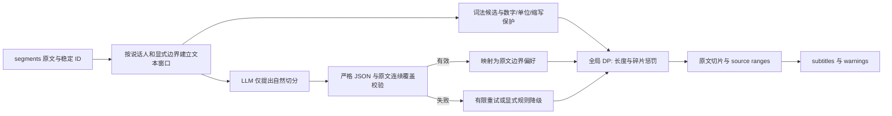

# 字幕文本切分研究与实验报告

GPT-5 nano 的 H1 前置步骤专项改进、377 次新增调用及推荐的无损边界投影见 [H1_IMPROVEMENT_REPORT.zh-CN.md](H1_IMPROVEMENT_REPORT.zh-CN.md)。

2026-09-07。范围严格限定为带标点的 `transcript segments[] → subtitles[]`，不研究音频、word alignment、字幕 start/end 或阅读速度。本次完成 65 条数据、两个模型的主要矩阵，以及 GPT-5 nano 推理设置补充实验，共 **785 次在线实验请求**（另有两个小型连通性/模型版本探测）。

## 结论

优先推进 **“LLM 提出自然边界 → 精确校验 → 原文切片 → 全局长度与碎片约束”**，而不是只更换模型、把提示词写得更严格，或让 LLM 独自负责字数上限。本轮 Gemini 的改进提示词与适度 DP 约束组合表现最好；GPT-5 nano 必须按推理设置分别看待，不能把某一次配置的结果概括为整个模型的能力。

Gemini 的 `H1_reward_1.5` 在 65 条样本上全部保留原文、全部满足上限、没有切断已标注的保护短语；参考边界宏 F1 为 0.957，短字幕 17 条。相同模型的现有 Mac 提示词有 19 次保护短语断裂、120 条短字幕，宏 F1 为 0.695。这是**本合成集的诊断结果**，不等于“95.7% 自然度”，也不能证明所有词语都未被切断。

奖励权重 1.5 来自首轮 Gemini 结果后的离线探索。它没有读取参考标签来生成字幕，但选参接触了这批数据，因此还需要新的独立文本及母语编辑复核。后加入的 GPT-5 nano 使用相同冻结提示词、候选规则和权重，没有按它的结果重新调参。

## 当前 Mac 问题：已确认到哪一层

只读检查本机保存的 workbench，找到与截图完全匹配的 Qwen 任务。保存的字幕是：

```text
先做一个起头的动作，整个把这个髂骨
跟肩椎的这个卡住这
个关节面先把它打开。
这个动作做完之后，后面的动作做会比较
顺，它可以把这个这髂骨把它能够自动
```

因此 `这｜个`、`比较｜顺` 已在持久化 cue 中，不是 SwiftUI 根据卡片宽度自动折行。[本地最小证据](/Users/adamwang/Project/subdub/voxella-studio-app/Experiments/subtitle_segmentation_20260907/local_evidence.json) 只保留截图对应片段；本机完整转录没有发给外部模型。界面通过 [SessionSegmentEditor.swift](/Users/adamwang/Project/subdub/voxella-studio-app/Sources/VoxstudioPro/Workbench/SessionSegmentEditor.swift:391) 调用 `renderedSubtitleText` 隐藏部分行尾标点，所以视觉上缺少句号不一定代表存储里没有句号。

代码路径为 `MediaFlowExecutor.prepareSubtitles → SubtitlePostprocessPipeline → SubtitleCascadePrompt / SubtitleReadabilityPolicy → SubtitleTrack → WorkbenchStore → SessionSegmentEditor`。文本输出落在 `SubtitleTrack.cues`；Transcript 标签另取较长的 `result.segments`。本轮未修改这些生产代码。

可证实的机制问题：

1. **中日文兜底候选可落在词内。** [characterRunTokens](/Users/adamwang/Project/subdub/voxella-studio-app/Sources/VoxstudioPro/MediaFlow/SubtitleTokenRemapper.swift:99) 对非 ASCII 字符逐字拆分，[splitTokenIndices](/Users/adamwang/Project/subdub/voxella-studio-app/Sources/VoxstudioPro/MediaFlow/SubtitleLLMProcessor.swift:186) 主要评分长度、均衡和少量标点，没有词法或依存保护。当前 Swift 在截图同类合成文本中实际产生 `比较｜顺`，并切出 `节｜奏`、`调｜整`。
2. **合规字数不能保证语义边界。** 当前 [segmentationFailureReason](/Users/adamwang/Project/subdub/voxella-studio-app/Sources/VoxstudioPro/MediaFlow/SubtitlePostprocessPipeline.swift:786) 主要校验文本、数量和上限；原文没变且不超长的坏边界可以通过。本轮 L0 的 Gemini 输出没有超长，所以 L0 的 19 次保护短语断裂不能归咎于后续长度兜底。
3. **超长后处理会改变好边界。** [cascade](/Users/adamwang/Project/subdub/voxella-studio-app/Sources/VoxstudioPro/MediaFlow/SubtitlePostprocessPipeline.swift:680) 遇到超长行优先本地重切。Nano 组实际触发了这一路径的文本重放，见 L0-length-repair 数据；它能消除部分超长，也可能重新断词或改变空格。当前完整长段的只读 Swift 重放再次出现了 `比较｜顺`，但批次不同，不能当作历史执行的精确复现。
4. **仅有 segments 的接口仍受 word 数量约束。** `makeSourceWords` 在没有 words 时把每个 segment 当作一个 SourceWord，而后续要求字幕条数不超过 sourceWordCount。两条长 segment 合理切成十余条字幕，也可能被拒绝。因此新文本切分核心不能直接保留这个依赖 word 数量的校验。
5. **token 重拼会改动正字法空格。** Swift R0 的 65 条全部保留非空白字符，但 16 条违反“只允许边界空白变化”的严格契约，例如 `U.S. → U. S.`、`USB-C → USB - C`、`a-t-elle → a - t - elle`。这不是删字率；表中“原文通过”专门反映内部空白也应保留。
6. **现有批次由 source words 重新组成文本。** 跨 segment/批次的上下文只能帮助理解，不能移动已被固定的输入范围。纯文本方案应把原 segment 作为来源映射，允许同说话人的相邻片段共同决定 cue 边界；明确的说话人/编辑边界仍须保留。

历史任务没有保存该次 LLM 原始回复及逐阶段边界，故无法断言截图这一轮具体是模型输出还是后处理导致。改造时应增加 `source hash / raw proposal / validator error / repair diff / fallback reason / final boundaries`，才能区分原因。

## 外部研究及可借鉴点

- Netflix 的通用规范要求换行尊重标点及语法单位，避免拆开冠词与名词、人名、助动词与动词等。这支持词法/短语保护，但其两行排版规则与本实验的 cue 切分不是同一层，不能直接照搬字数。来源：[Timed Text Style Guide](https://partnerhelp.netflixstudios.com/hc/en-us/articles/215758617-Timed-Text-Style-Guide-General-Requirements)。
- ACL 2023 的方法利用 masked language model 在候选位置的标点概率预测边界，并保留原文。这说明“模型评边界、确定性程序保文本”可独立于 ASR，也不一定需要生成整段新字幕。本文只借鉴思路，没有下载或运行论文模型。来源：[Unsupervised Subtitle Segmentation with Masked Language Models](https://aclanthology.org/2023.acl-short.67/)。
- 字幕边界评估与文本正确性应分开。Σ 研究讨论了生成文本变化时的分割评价；本轮由于要求原文不变，直接对 source offsets 计算边界 F1，并将改写另记失败。F1 只比较一种参考切法。来源：[Evaluating Subtitle Segmentation](https://aclanthology.org/2022.lrec-1.328/)。
- 后续应引入真实字幕来源和编辑修订数据，而不只扩写合成集。MuST-Cinema 提供保留字幕边界的 TED 多语言材料，可作为部分语言的外部基准，但不能假定覆盖本需求全部七种语言、域和授权用途。来源：[MuST-Cinema](https://aclanthology.org/2020.lrec-1.460/)。

worker 的 `_build_split_only_prompts` 已把纠错与切分分开，要求拼接保持原文，值得保留；其输出仍含无关 `batch_summary`，并且靠提示词表达上限。本轮 LW 实际调用原函数生成提示词，没有重写一个近似版本。更早的联合纠错/标点/对齐流程不属于本题矩阵。

## 数据与矩阵

| 语言 | 条数 | 每条完整文本字符范围 |
| --- | --- | --- |
| en | 20 | 327–427 |
| zh-Hans | 20 | 136–153 |
| ja | 5 | 152–170 |
| de | 5 | 401–463 |
| fr | 5 | 398–497 |
| es | 5 | 377–506 |
| pt-BR | 5 | 377–503 |

每条含两个 segment，均为同一说话人；接缝有自然边界，也有词中/短语中边界。所有文本含标点。题材、参考边界、保护短语、来源及预先分配的 13/52 分组都在 [dataset.json](/Users/adamwang/Project/subdub/voxella-studio-app/Experiments/subtitle_segmentation_20260907/dataset.json)；直接阅读版为 [DATASET.md](/Users/adamwang/Project/subdub/voxella-studio-app/Experiments/subtitle_segmentation_20260907/DATASET.md)。中日文部分原始表达刻意保留不自然口语，切分不能顺便纠错。

主要矩阵每模型 353 次：`65 × 4 提示词 × 默认上限 + 65 × 编号提示词 × 较宽上限 + 14 × 2 条件复跑`。Nano-low 补充只跑 L1 的 65 条及 14 条复跑，共 79 次。规则和混合方案从真实结果离线执行，不冒充新的 LLM 调用。

默认上限为中日文 18、其他语言 56；较宽上限为 24/72。目标值仍为 14/42，便于隔离上限影响。L0=Mac 原提示词；LW=worker 原提示词；L1=强化短语约束的文本输出；L2=词法候选编号输出；H1=L1精确映射+DP；H2=L2+DP。完整算法、评分公式和复跑命令在 [PROTOCOL.md](/Users/adamwang/Project/subdub/voxella-studio-app/Experiments/subtitle_segmentation_20260907/PROTOCOL.md)。

## 实测：模型、提示词与流程

“长度通过”以整条样本为单位，要求原文有效且没有超长 cue。“保护断裂”仅统计原文有效样本的已标注短语；改写失败不以零断裂掩盖。宏 F1 将无效样本记零。耗时为原始模型请求中位数；混合流程复用该耗时，未加很小的本地 DP 时间。`fallback` 指无效模型建议被丢弃、明确退回 R1 的条数。

| 模型/设置 | 方案 | 原文通过 | 长度通过 | 保护断裂 | 短cue | 宏F1 | fallback | 请求中位秒 |
| --- | --- | --- | --- | --- | --- | --- | --- | --- |
| Gemini | L0_app | 65/65 | 65/65 | 19 | 120 | 0.695 | 0 | 1.20 |
| Gemini | L0_length_repair | 65/65 | 65/65 | 19 | 120 | 0.695 | 0 | 1.20 |
| Gemini | LW_worker | 61/65 | 54/65 | 5 | 68 | 0.846 | 0 | 1.26 |
| Gemini | L1_semantic | 64/65 | 64/65 | 0 | 180 | 0.902 | 0 | 1.21 |
| Gemini | L2_ids | 65/65 | 11/65 | 0 | 9 | 0.800 | 0 | 1.03 |
| Gemini | H1_reward_1.5 | 65/65 | 65/65 | 0 | 17 | 0.957 | 1 | 1.21 |
| Gemini | H2_ids_dp | 65/65 | 65/65 | 2 | 14 | 0.886 | 0 | 1.03 |
| GPT-5 nano / minimal | L0_app | 64/65 | 1/65 | 3 | 2 | 0.483 | 0 | 1.56 |
| GPT-5 nano / minimal | L0_length_repair | 49/65 | 49/65 | 12 | 3 | 0.456 | 0 | 1.56 |
| GPT-5 nano / minimal | LW_worker | 65/65 | 0/65 | 0 | 0 | 0.501 | 0 | 1.66 |
| GPT-5 nano / minimal | L1_semantic | 50/65 | 0/65 | 2 | 5 | 0.408 | 0 | 1.55 |
| GPT-5 nano / minimal | L2_ids | 44/65 | 0/65 | 3 | 12 | 0.030 | 0 | 1.06 |
| GPT-5 nano / minimal | H1_reward_1.5 | 65/65 | 65/65 | 3 | 4 | 0.845 | 15 | 1.55 |
| GPT-5 nano / minimal | H2_ids_dp | 65/65 | 65/65 | 4 | 11 | 0.813 | 21 | 1.06 |
| GPT-5 nano / low | L1_semantic | 24/65 | 15/65 | 2 | 8 | 0.279 | 0 | 10.85 |
| GPT-5 nano / low | H1_reward_1.5 | 65/65 | 65/65 | 3 | 9 | 0.837 | 41 | 10.85 |

**需要联合看指标。** Nano 的混合结果高于它的原始模型输出，不意味着 Nano 已经学会切字幕；一部分结果来自拒绝无效建议后执行本地 R1。L2 保证文本来自原文，也不能保证模型返回合法 ID、合适边界或符合最大长度。Gemini L2 默认虽然 65/65 保留原文，仍有 172 条超长 cue。

Nano 的 L1 从 minimal 改为 low 后，原文严格通过率从 50/65 降为 24/65，请求中位耗时从 1.55 秒升为 10.85 秒。785 条回包都正常终止，没有触及输出截断；这组退化不能简单归因于 token 上限。它说明更多推理未必更符合本任务的“不可改写”契约，仍不能据此推断其他提示词或领域也会相同。

### 七语种对照

以下均为 H1，奖励权重固定 1.5。每格为 `宏F1 / 保护短语断裂 / fallback样本数`，不是母语自然度评分。

| 语言 | Gemini | Nano minimal | Nano low |
| --- | --- | --- | --- |
| en | 0.969 / 0 / 0 | 0.869 / 0 / 2 | 0.856 / 0 / 8 |
| zh-Hans | 0.955 / 0 / 1 | 0.871 / 2 / 8 | 0.861 / 2 / 18 |
| ja | 0.909 / 0 / 0 | 0.702 / 1 / 1 | 0.653 / 1 / 3 |
| de | 1.000 / 0 / 0 | 0.869 / 0 / 1 | 0.849 / 0 / 4 |
| fr | 0.925 / 0 / 0 | 0.797 / 0 / 1 | 0.882 / 0 / 2 |
| es | 0.944 / 0 / 0 | 0.835 / 0 / 1 | 0.803 / 0 / 3 |
| pt-BR | 0.971 / 0 / 0 | 0.820 / 0 / 1 | 0.820 / 0 / 3 |

### 规则与 segment 接缝

| 方案 | 上限 | 原文通过 | 保护断裂 | 超长cue | 短cue | 标点开头 | 宏F1 |
| --- | --- | --- | --- | --- | --- | --- | --- |
| R0_swift | default | 49/65 | 22 | 0 | 1 | 5 | 0.277 |
| R0_swift | wide | 48/65 | 11 | 0 | 0 | 2 | 0.243 |
| R1_dp | default | 65/65 | 5 | 0 | 3 | 1 | 0.826 |
| R1_dp | wide | 65/65 | 6 | 0 | 1 | 1 | 0.757 |
| R1_isolated | default | 65/65 | 8 | 0 | 9 | 2 | 0.789 |

同样的 R1，把 segment 独立切再拼起来，默认上限下保护短语断裂从 5 增加到 8，宏 F1 从 0.826 降至 0.789。由此支持同说话人可合并窗口的设计，但本轮没有覆盖多说话人、跨项目生命周期或几小时文本。

R1 比 R0 更稳，但会把中文 `3.5%`、日文混合标识 `v2.1` 错当标点边界；也可能拆 `Prof. Lewis`。所以语言 tokenizer 不等于短语分析器。数字、缩写、单位、人名和引号需要单独的可靠保护层。

### 上限与权重敏感性

| 模型 | H2上限 | 宏F1 | 保护断裂 | 短cue | fallback |
| --- | --- | --- | --- | --- | --- |
| Gemini | default | 0.886 | 2 | 14 | 0 |
| Gemini | wide | 0.864 | 0 | 9 | 0 |
| GPT-5 nano / minimal | default | 0.813 | 4 | 11 | 21 |
| GPT-5 nano / minimal | wide | 0.736 | 8 | 9 | 19 |

放宽最大字数并不保证每个模型都改善。Gemini 的 H2 断裂减少，但 Nano 的较宽组合可能因建议失效与退回规则而恶化；不可只看输出条数变少。

Gemini H1 的离线奖励权重消融：

| 方案 | 宏F1 | 保护断裂 | 短cue | 标点开头 |
| --- | --- | --- | --- | --- |
| H1_reward_0.5 | 0.947 | 0 | 8 | 1 |
| H1_reward_1.0 | 0.957 | 0 | 12 | 1 |
| H1_reward_1.5 | 0.957 | 0 | 17 | 0 |
| H1_text_dp | 0.926 | 0 | 124 | 0 |

每个模型建议边界都给过高奖励，会鼓励保留过碎的切法。将奖励从 2.5 降到 1.5，Gemini 的短 cue 从 124 减为 17。0.5/1.0 的版本仍有法文引号边界缺陷。这是探索性选参，不应把 1.5 当成所有语言和题材通用常数。

## 代表性错误

- `zh-Hans-01`：现有 Swift 兜底产生 `……比较｜顺，……`；原提示词也可能把依存成分分开。应保留 `后面的动作做会比较顺，` 这一完整短语，而不是在“比较”后补时间或重新对齐。
- `zh-Hans-13`：Gemini L0 将 `3.5%` 切成 `3.｜5%`。L1 虽保护数字，却切出了 26 条字幕，其中 23 条低于建议最小长度。H1(1.5) 用同一次 L1 建议重新组合为 12 条，保留 `报告里面写的是增长3.5%，`。
- `zh-Hans-16`：Gemini L1 把全角逗号改成半角逗号。必须记为失败，不能用“统一标点”掩盖。H1 丢弃该建议并记录 fallback。
- `ja-01 / ja-03`：Gemini worker 提示词输出混入简体字，如 `確認→确认`，并出现词语改写。切分与纠错仍需在结构上分开。
- `en-13 / fr-04`：R0 重拼改变 `U.S.`、`a-t-elle` 等词内空格；Mac L0 在法文中还拆开 `petite valise bleue` 和 `tableau des départs`。
- `en-06 / zh-Hans-20`：Gemini H2 默认约束仍拆开 `old library`、`新出炉`。原文切片只能防改写，不能自动保证语义。

所有条件的每条输出见 [跨模型逐条对照](/Users/adamwang/Project/subdub/voxella-studio-app/Experiments/subtitle_segmentation_20260907/cross_model.html)，完整原始回包保存在各配置的 `raw/` 中。`subtitles.json` 另提供带原 segment 字符范围的纯文本 cue 输出；无效结果的 `subtitles` 明确为 null，不返回成功形状。

## 可实施的改进流程



建议把文本核心放在字幕 feature 下，只有一个权威源：不可变的 finalized transcript 与 source map。所有 UI、Agent、批处理和兜底共享相同的候选边界、预算及校验。文本切分不要依赖 ASR word 数量；时间处理作为下游独立阶段，不在本实验中实现。

对超过最大字数的不可拆专名/单词，必须返回明确 `over_budget_atomic_span`，而不是悄悄从中间切断。JSON、ID、递增性、末尾覆盖、重复/遗漏、原文变化均须检查。对语义上可疑而形式合法的输出，应提供需复核状态或边界风险；不能只返回“成功”。

模型重试只请求重新分段，不重跑纠错；失败后也保留同一原文。正文里的指令视为转录数据。后台任务以文本 hash、语言、预算、模型/提示词/算法版本为完整 key；返回时校验任务 generation 与项目身份，取消和旧结果不能提交。缓存容量、并发上限、关闭行为需在生产接入时另做确定性测试。

短期可先验证 H1 文本建议+严格映射+适度 DP；编号方案有结构性保真优势，但本轮输入 token 更多、Nano 的编号遵从性较弱，需要压缩候选表示和更可靠的长度提示后再比较。不要一次性替换当前整条转录/对齐流程。

## 资源、稳定性与限制

| 配置 | 实验请求 | 输入tokens | 输出/完成tokens | 其中reasoning tokens | 实际返回模型 |
| --- | --- | --- | --- | --- | --- |
| Gemini | 353 | 288502 | 33630 | 未单列 | {'gemini-3.5-flash-lite': 353} |
| GPT-5 nano / minimal | 353 | 285179 | 27319 | 0 | {'gpt-5-nano-2025-08-07': 353} |
| GPT-5 nano / low | 79 | 35165 | 152223 | 142976 | {'gpt-5-nano-2025-08-07': 79} |

GPT completion tokens 含推理 token；不同厂商 tokenizer 不同，不能直接把 token 数当等量计算或费用。Nano 使用 `minimal`/`low`，未发送不支持的 temperature；Gemini temperature=0。API 参数依据 [GPT-5 nano 模型文档](https://developers.openai.com/api/docs/models/gpt-5-nano) 与 [GPT-5 系列参数兼容说明](https://developers.openai.com/api/docs/guides/latest-model?model=gpt-5.2) 核对；Gemini 请求依据 [generateContent](https://ai.google.dev/api/generate-content)。

| 配置 | 条件 | 两次逐字相同 |
| --- | --- | --- |
| Gemini | L1_semantic | 5/14 |
| Gemini | L2_ids | 8/14 |
| GPT-5 nano / minimal | L1_semantic | 5/14 |
| GPT-5 nano / minimal | L2_ids | 9/14 |
| GPT-5 nano / low | L1_semantic | 0/14 |

即使 temperature=0，Gemini 的 14 条复跑也并非全部一致。不要用一次回包作为稳定质量承诺。此次为短文本、单机、有限并发实验；本地 R0 与 R1 测量范围不同，未声称 App 性能提升。

数据和参考切法由同一助手编写，保护词表不完整，五种语言只有 5 条，多个题材平行，且未做母语盲评。没有真实音频、长文本压力、多说话人、字形宽度、两行 cue 排版或真人偏好检验。最终选型仍需要新的真实场景文本，以及至少两位熟悉目标语言的字幕编辑独立评分。

## 交付与验证

- [实验协议与复跑命令](/Users/adamwang/Project/subdub/voxella-studio-app/Experiments/subtitle_segmentation_20260907/PROTOCOL.md)；[数据 JSON](/Users/adamwang/Project/subdub/voxella-studio-app/Experiments/subtitle_segmentation_20260907/dataset.json)；[可读数据集](/Users/adamwang/Project/subdub/voxella-studio-app/Experiments/subtitle_segmentation_20260907/DATASET.md)。
- [跨模型可筛选对照](/Users/adamwang/Project/subdub/voxella-studio-app/Experiments/subtitle_segmentation_20260907/cross_model.html)；[纯文本 subtitles 与来源范围](/Users/adamwang/Project/subdub/voxella-studio-app/Experiments/subtitle_segmentation_20260907/subtitles.json)。
- [Gemini 汇总](/Users/adamwang/Project/subdub/voxella-studio-app/Experiments/subtitle_segmentation_20260907/summary.csv)；[Nano minimal 汇总](/Users/adamwang/Project/subdub/voxella-studio-app/Experiments/subtitle_segmentation_20260907/nano/summary.csv)；[Nano low 汇总](/Users/adamwang/Project/subdub/voxella-studio-app/Experiments/subtitle_segmentation_20260907/nano_low/summary.csv)。
- 已实际运行原 Swift 文本辅助代码的 `swiftc -O` 提取编译与执行；实际完成全部模型矩阵；Python 合同回归测试及 source-range 回读校验。具体最终测试记录见 `verification.txt`。
- 未修改 App 生产源码，因此没有运行完整 `swift build`、`swift test` 或 BundledSpeech 构建；没有声称 UI 或端到端字幕时序通过。当前工作区原有修改已保留。
- 对照页的 65 个样本选项与页面结构已自动校验；内置浏览器拒绝访问本地 `file://` 页面，未完成浏览器视觉或筛选交互验收。可自行用本地浏览器打开交付的 HTML。

人工复核步骤：打开跨模型页面，先选 `zh-Hans-01/13/16`，再选每种语言的数字/专名与对话样本；比较是否断词、是否有孤立修饰词、是否短得影响阅读、是否无意义地跨句。记录自然度 1–5、严重边界错误和偏好理由。随后在隔离 App 项目中接入候选算法，验证字幕视图/原始文本/导出一致，重新生成可取消，旧结果不覆盖新编辑，保存重开保持结果；这些 UI/生命周期场景尚待实现及人工确认。
