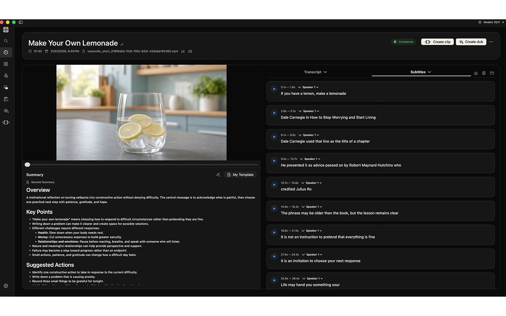
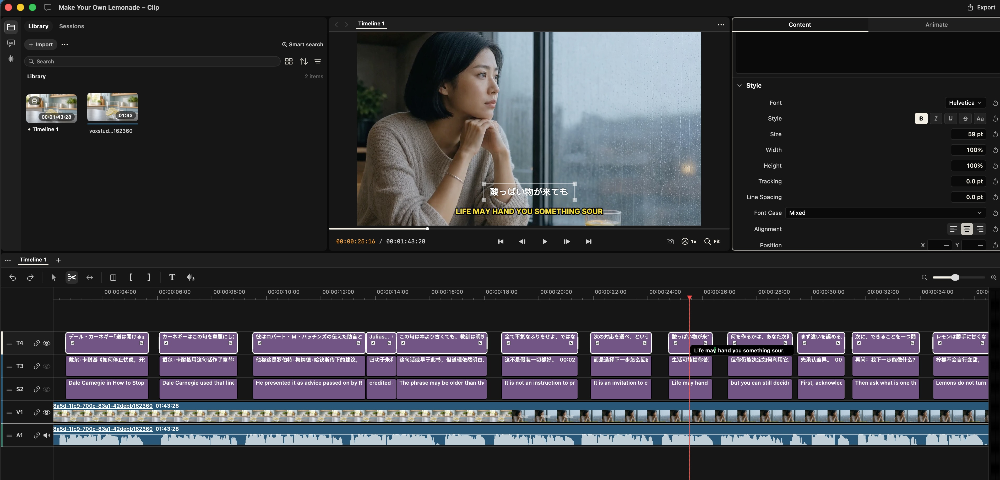
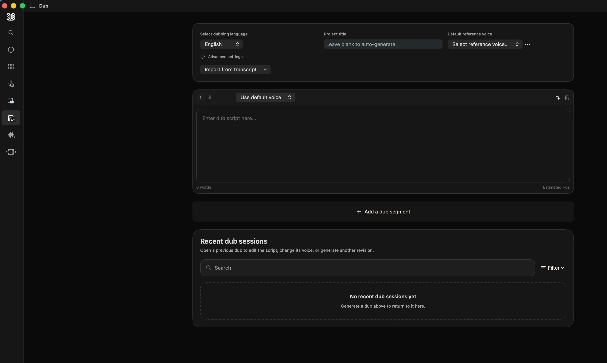

# VoxStudio

VoxStudio is an AI-native video workspace for turning recorded sessions into edited videos and dubbed versions. It combines transcription, timeline editing, translation, voice-cloned dubbing, and media export in a native macOS application.

> macOS 26 (Tahoe) and Apple Silicon are required.

## What it does

### Transcribe sessions

Create a session from imported media or a screen, window, system-audio, or microphone recording. VoxStudio can produce a time-aligned transcript, detect speakers, and prepare the session for search, editing, subtitles, and downstream media workflows.



### Edit video from a session

Send session media and transcript data into a non-linear timeline. The editor supports multi-track video and audio, trimming, splitting, ripple and overwrite operations, captions, subtitles, keyframes, effects, multicam workflows, audio tools, preview playback, and export.



### Create dubbed versions with a cloned voice

Prepare a translated or rewritten script, select a reference voice, synthesize timed speech, and assemble the result back into a session or timeline. The workflow keeps source audio, transcript segments, subtitle tracks, generated speech, and dubbed output associated with the same project context.



### Work with AI agents

VoxStudio exposes the editor through an in-app agent and a local MCP HTTP server. Agents can inspect projects, import and organize media, edit timelines, work with captions and subtitles, generate media, and export results through the same domain operations used by the UI.

## Architecture

VoxStudio is a Swift-native macOS application built with Swift 6.2, SwiftUI, AppKit, and AVFoundation. SwiftUI is used for application surfaces and workflow panels; AppKit is used where the editor needs precise native macOS interaction, including timeline input and rendering; AVFoundation handles media composition, playback, audio, and export.

```text
Media / recording
       │
       ▼
Transcription session ──► MediaFlowExecutor
       │                    ├─ transcription, VAD, diarization, alignment
       │                    └─ translation and subtitle-track processing
       │
       │ sourceTranscriptionID
       ▼
Dub session ─────────────► MediaFlowExecutor
       │                    ├─ script and reference-voice selection
       │                    ├─ speech synthesis and segment alignment
       │                    └─ dubbed audio and subtitle-track assembly
       │
       ▼
WorkbenchSession
       │
       ├─ Open as clip project ──► WorkbenchEditorBridge
       │                             └─ EditorViewModel
       │                                └─ Timeline / Preview / Export
       │
       └─ Media-browser drag/drop ─► session ID + subtitle scope
                                      └─ linked timeline clips

In-app Agent / MCP HTTP server ─────► same Workbench and editor operations
```

The main layers are:

- **Transcription sessions** — `WorkbenchStore` owns source media, transcripts, word timings, speaker information, source subtitles, translation tracks, summaries, processing state, and session-level exports.
- **Dub sessions** — a `WorkbenchDubJob` is the durable dubbing record. It stores the script, target language, reference voice or reference audio, per-speaker or per-segment voice assignments, rendered segments, aligned transcript, dubbed subtitles, output revisions, and processing state. A dub references its source transcription through `sourceTranscriptionID`; standalone dubs are also exposed as `WorkbenchSession` values with `sessionType = dub`.
- **Unified session projection** — `WorkbenchStore.sessions` combines transcription jobs, their linked dub jobs, and standalone dubs into `WorkbenchSession` values. This gives the UI, search, export, and editor workflows one session-level view while preserving the underlying transcription and dub records.
- **Media-flow pipelines** — orchestrates long-running transcription, translation, subtitle, and dubbing stages while reporting progress and respecting cancellation.
- **Session-to-editor bridge** — `WorkbenchEditorBridge.openSession` creates a `VideoProject` and asks `EditorViewModel` to place the session. Source media is imported onto a standard audio or video track; source and translation subtitle cues are converted into timeline text clips; and generated dub audio is placed on a dedicated dub track when needed.
- **Session identity on the timeline** — inserted media and subtitle clips retain `sourceSessionId`, `sourceCueId`, and `sourceCueScope`. The media browser uses stable session IDs and explicit scopes for source, translation, and dub subtitle drag-and-drop, so timeline content remains traceable to its originating session.
- **Editor-originated processing** — transcription, translation, and dubbing can also start from a selected timeline clip. The editor creates or updates the corresponding Workbench job, waits for the terminal result, then links the clip and inserts the resulting subtitle or dub track using the same session-aware operations.
- **Project and timeline model** — represents project settings, media manifests, tracks, clips, captions, effects, keyframes, and linked session media.
- **Editor and preview** — coordinates user mutations, undo, timeline interaction, AVFoundation composition, playback, frame rendering, and export.
- **Local AI and backend services** — routes on-device speech and audio processing, optional cloud transcription/dubbing services, model downloads, authentication, and storage.
- **Agent and MCP** — provides stable filmmaker-oriented tools that reuse editor mutations instead of maintaining a separate editing implementation.
- **Persistence** — stores projects as package documents and serializes timeline, media, chat-session, generation, and session data through the project package coordinator.

## Technology

- Swift 6.2 and Swift Package Manager
- SwiftUI and AppKit
- AVFoundation, AVKit, ScreenCaptureKit, and SoundAnalysis
- On-device speech processing and optional bundled MLX speech models
- MCP over a local HTTP endpoint for external agents
- SQLite vector search and embedding-backed media/session retrieval

## Build and run

```bash
git clone https://github.com/voxstudio-me/voxstudio-pro.git
cd voxstudio-pro

swift build
swift run
```

To include the optional bundled speech and MLX resources:

```bash
swift build --traits BundledSpeech
```

Run the test suite with:

```bash
swift test
```

## MCP server

When enabled and the app is running, VoxStudio serves MCP over HTTP at:

```text
http://127.0.0.1:19789/mcp
```

For example, Codex can connect with:

```bash
codex mcp add voxstudio --url http://127.0.0.1:19789/mcp
```

The app also includes MCP setup instructions for supported clients in **Help → MCP Instructions**.

## Acknowledgements

The video-editing portion of VoxStudio is inspired by and builds on the open-source [Palmier Pro](https://github.com/palmier-io/palmier-pro) GitHub project. We are grateful to the Palmier Pro authors and contributors for sharing the editor foundation and ideas with the community.

Please see [LICENSE](LICENSE) for licensing information.

## Contributing

Bug reports, feature ideas, and improvements are welcome. See [CONTRIBUTING.md](CONTRIBUTING.md) for development and contribution guidelines.
