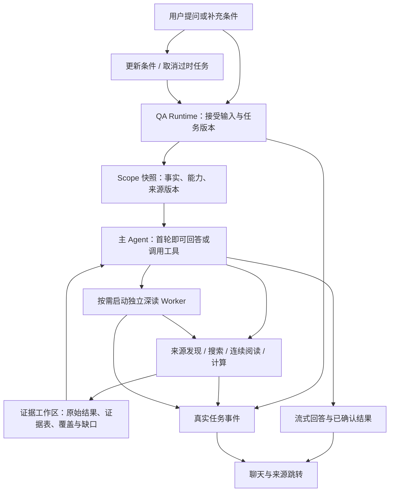

# 知识库 Agentic QA v2：围绕证据组织搜索、阅读与分析

日期：2026-09-29  
范围：macOS 知识库 QA、Hosted 网关、BYOK 原生协议。保留 hybrid search、reranker、MMR、SQLite 和可选知识图。

恢复说明：本提案原为未追踪文件，在共享目录被其他操作重置时删除。第 4–7 节及第 9–11 节根据本次会话已读取原文恢复；前部与第 8 节依据用户提供的方案整理。具体已实现能力和待验收项目见 [实施记录](knowledge-base-agentic-qa-v2-implementation.zh-CN.md)，不要将规划目标视为实测成绩。

## 1. 核心决策与目标体验

建立共享证据工作区：主 agent 围绕问题组合来源发现、连续阅读、混合搜索、确定性计算和定向核查。每次操作更新同一份有来源、有范围、有版本的证据状态。

事实首轮可见、原生工具调用、完整 observation 和真实流式输出是基础。自适应阅读、来源 × 问题维度证据表、本地计算与可持续对话研究过程提供更进一步的问答能力。

| 问题 | 目标行为 |
| --- | --- |
| 这个视频多长？ | 首轮使用可信媒体时长，口播位置独立标注；未知不从转录推算 |
| 长录音讲了什么？ | 先读 summary/时间结构，再对缺口定位与连续阅读 |
| 三次会议为何改计划、谁有异议？ | 保留全部来源和每个问题维度；原文核查提议、决定、修改理由与冲突 |
| 全部资料有多少份？ | 完整目录的确定性聚合；Top-K 不能成为全集 |
| 只看最后一次会议的风险 | 新任务版本取消过时工作，复用兼容证据 |

## 2. 源码依据与当前缺口

重构前基线为 `f2d9f81b`。`KnowledgeQAService.dispatch` 串行执行 planner 和 skill selection；`KnowledgeAgentRuntime` 通过文本 JSON 正则调用工具，之后 composer 从 citations 再造上下文。元数据、summary 等工具完整结果会在此过程中损失。

`KnowledgeRetrievalService` 已有词法/向量混合、重排、MMR 和可选图召回。它们主要解决相关片段召回，无法判断某次会议、问题维度或时间阶段是否遗漏。顺序拼接后截断也可能挤掉图通道。全局 8 条证据不足以支持所有概述、比较、变化分析与穷举任务。

`WorkbenchSession.duration` 混合 durationHint、转录和配音终点；旧索引 duration_sec 也混合来源。不能仅替换成这个 duration 字段。媒体总长、最后口播、已转录范围和来源必须分别保存。

## 3. 沿用已有底座

保留现有模型、索引和 MLX 推理调度门。来源卡片和摘要用于先浏览，hybrid + reranker 定位具体内容，连续原文读取用于核查否定、条件、指代及后续修正。图检索按实体关联、多跳或证据缺口显式启用。

相关性与覆盖分别控制：reranker 判断相关性，MMR 去重复，来源/维度预算防止遗漏。无相关证据的来源仍保留未知。增多 agent 不保证本地推理更快；I/O 并行、MLX 排队和独立上下文 worker 应区分。

## 4. 共享证据架构

主 agent 决定问题含义、阅读策略、下一步和回答。运行时负责权限、数据完备标记、引用解析、预算、取消和持久化。证据是否在语义上支持一个结论仍需要模型判断和评测，不能靠一个 reranker 阈值或“有 citation”布尔值保证。

建议先引入四种共享对象，避免各条路径自造上下文：

| 对象 | 必须包含的内容 |
| --- | --- |
| `ScopeSnapshot` | scope IDs、当前明确焦点、账户/来源过滤、来源版本、已知媒体事实、catalog/summary/lexical/embedding/graph 可用性；大集合仅附有界目录概览和完整性信息 |
| `EvidenceItem / EvidenceBundle` | 稳定 evidence ID、来源版本、证据类型、原文或字段值、时间/segment 定位、speaker、派生来源、返回范围、分页与截断状态、可恢复错误 |
| `AnalysisView` | 当前问题的来源集合、维度、带引用的观察/结论、冲突、未知项和已做的聚合操作；复杂问题按需创建 |
| `QARunState` | conversation/run/task IDs、plan revision、pending jobs、预算、已发布片段、native provider continuation 状态和终止原因 |

证据类型至少区分 metadata、summary、transcript、timeline、speaker、aggregate。原文、生成摘要、图中的关联线索不能在存储或提示中混为同一可信度。

“工具观察整包保留”落实为：**下一轮拿到完整的、有界的工具响应；工作区保存完整底层结果和可重读句柄。** 大数据工具明确返回 `returned_count / total_count? / complete / next_cursor / payload_ref`，不会静默截断，也不会为了保留结果把数百页原文灌进上下文。

## 5. 六项核心设计

### 5.1 事实与能力首轮可见，移除不必要的准备门禁

在首个模型请求前，取得本地可用的 scope 事实：标题、类型、来源、日期及其语义、是否存在转录/摘要、可信媒体时长、最后转录结束位置。读取不依赖 WeMM、reranker 或图。

单来源放入当前来源卡片；多来源放入有界卡片集合；全库放入可见集合统计与目录句柄。不能把所有卡片全文前置，也不能把“这个视频”默认解释成全库最新一条。没有唯一焦点、历史指代也不能确定时才澄清。

细化当前统一的 ready gate：catalog 能回答的请求可以开始；只有实际需要向量检索、rerank 或图时才检查对应资源。已有转录但缺 embedding 时，可以连续阅读或词法搜索；工具应返回能力缺失状态。需要下载的功能沿用已有下载和许可流程。

时长采用可追溯字段：

- `media_duration_sec: Double?`：源媒体元数据或语义明确的云端时长；记录来源和版本。
- `last_spoken_end_sec: Double?`：当前转录中最后有效 segment/cue 的结束位置。
- `transcribed_range`：若只转录了媒体片段，保留片段范围与时间坐标约定。

不能把 `WorkbenchSession.duration` 原样复制为 media duration；本地 job 当前也没有可靠 durationHint 字段，需要接入现有媒体元数据读取/缓存。旧 `duration_sec` 的来源混合，迁移时先保留 legacy provenance，按需用原始 hint/媒体探测补齐，并独立计算 last spoken end。仅修元数据不要求全库重新 embedding。

未知值用 null 与原因表示，不能用 0 秒冒充已知。source created/recorded/imported/modified 时间也需区分，“上周的会议”不能无说明地变成“上周被编辑过的文件”。

### 5.2 让 Agent 选择“直接读、先浏览、再搜索”

这几种策略属于同一个循环，模型可切换，不设置新的关键词路由器。

| 问题需要 | 初始策略 | 何时进一步搜索 |
| --- | --- | --- |
| 已知字段、目录计数 | 使用事实快照或目录聚合 | 对象/字段真正缺失时 |
| 一个很短来源的概述或推理 | 直接读完整转录，控制 token 预算 | 需要外部于该来源的关联时 |
| 长来源的主题概述 | 读已有 summary/时间结构；确认可用覆盖范围 | 细节、引语、存在冲突或摘要没有覆盖的问题 |
| 精确语句、人物、时间点 | 限定 source/speaker/time 的查找与连续阅读 | 第一次定位失败、需要补充上下文时 |
| 跨来源比较或变化 | 先建立来源集合与比较维度 | 针对每个缺口查找、精读和核查 |

短文本直读阈值按模型上下文与当前剩余预算配置，先用小规模上限实验。长来源缺摘要时可以先生成本次任务使用的有界概览，明确其覆盖深度；不能把读了开头几段标记为“已读完整来源”。

检索查询保留专有名词、原文语言、speaker/time 过滤与问题维度，回答语言和字数约束另存。指代消解由主 agent 利用历史与 scope 完成。附件中的并行 query rewrite 保留为可选优化：仅在确有收益的追问上触发，结果绑定当前任务版本，不能阻塞事实回答，也不能覆盖用户刚更新的范围。

### 5.3 将现有 retrieval core 改成可组合、有反馈的取证操作

保留现有模型和索引作为基线，改造它们之间的协作方式。

**第一步：先找来源，再找具体片段。** 对全库探索，复用 `sessionSearch` 和卡片摘要做来源级候选发现，同时保留 transcript 通道补充摘要遗漏。对要求穷举的目录或语义分类问题，显式枚举来源，不能仅依赖来源级 Top-K。

**第二步：查询按缺口分解。** 主 agent 可一次提交少量有不同目的的查询，例如“最初方案”“修改理由”“反对意见”。开始时不为所有问题生成多个改写。结果已有足够支持时立即回答；重复检索没有新证据时改变阅读层级或停止。

**第三步：融合保留每个通道的机会。** 现有词法/向量 RRF 保留；hybrid 与 graph 的候选融合改成显式配额或 rank fusion，记录候选来自哪个通道。权重通过消融实验确定，避免先拼接后截断使某个通道被系统性挤掉。

**第四步：重排与覆盖分别处理。** reranker 继续负责 query–原始片段相关性。MMR 继续利用已有向量去重。对多来源/时间变化问题，在相关候选中按 source、问题维度或时间阶段分配证据预算；没有相关证据的格子标记未知，不能为了凑覆盖塞入无关片段。最终 K 由当前任务与上下文预算决定，不再把全局 8 条当成所有问题的证据容量。

**第五步：命中之后读前后文。** 复用 `transcriptContext/contextUnits`，把相关命中扩展成可理解的连续语段；遇到否定、条件、修正、指代时优先补读。保留原子 segment 与实际时间范围，处理 chunk overlap，避免将上一窗口的文本误挂在当前窗口的引用时间上。

**第六步：按需补图检索。** 普通直接阅读和事实问题不启动图。跨会话实体关联、多跳问题或检索缺口可以显式使用已启用的图。主 agent 已提供结构化 entity seeds 时复用它们，避免图内部再次做相同实体理解；保留原有有界扩展和可见性约束。图产生找原文的线索，结论仍链接到原始材料。

快速结果不必等待所有增强分支：基本 hybrid 结果形成首批证据；慢图扩展或额外来源深读通过独立 job 提交后续证据。普通同步工具调用仍遵循供应商协议完成一个工具回合，不能把内部并行误称为模型原生异步继续。

新增检索反馈字段包括：召回/重排/选中数量、来源分布、查询覆盖维度、缺失能力、是否截断、是否真的执行图、是否还有可读内容。分数只是检索诊断，不展示为答案置信度百分比。

### 5.4 复杂问题生成一张可追溯的证据表

例如“这三次会议的发布决定如何变化”，中间结果可以是：

| 来源 | 方案 / 决定 | 理由 | 异议 | 核查状态 |
| --- | --- | --- | --- | --- |
| 会议 A | 待填，关联 evidence IDs | 待填 | 待填 | 摘要已读，原文未核查 |
| 会议 B | 待填 | 待填 | 待填 | 尚未读取 |
| 会议 C | 待填 | 待填 | 待填 | 尚未读取 |

Agent 依据空白与冲突派发工作。摘要用于导航或一般概述；精确引语、决定状态、因果解释和争议应回到原文。模型抽取的“提议 / 同意 / 否决 / 后来修改”记录为派生观察并附证据，不能当作原始结构化事实。

覆盖分成两个层次：

- **可机械核验**：列举了多少来源、读了哪些范围、是否还有分页、是否有来源不可访问。
- **需要语义判断**：用户问的各维度是否得到支持、是否有矛盾、结论是否过度推断。

“读过 10/10 个摘要”只说明摘要阅读进度，不能说明 10 份转录中没有遗漏。尤其是否定、全称和语义计数问题，必须区分“明确不存在”“没找到”“尚未充分检查”。

本地计算接管 `filter / group / count / sum / sort / join` 等有类型操作。元数据统计可以得到精确值；语义分类的未知项保留未知。聚合证据同时保存输入集合、过滤条件、日期口径、缺失值数量与版本。主 agent 解释结果，不逐条口算。

工具接口先扩展已有 registry/executor：目录工具补分页与总量，读取工具支持有界批量，补 speaker 读取和确定性聚合。必要时提供有限的只读批量计划，原语只覆盖上述操作；第一阶段不引入任意 Python/SQL 执行环境。借鉴 programmatic tool calling 的数据处理分工，同时保持本地执行和供应商中立。

普通问题不创建比较表、不启动额外 verifier。复杂比较、冲突、归因、穷举才触发定向核查：给核查任务具体主张和证据，而不是让另一个 agent 再完整回答一次。

### 5.5 用有版本的理解缓存加速追问与重复分析

工作区首先复用本次对话内的已读材料、明确指代和分析视图。用户问“那谁反对”，可以沿已有决定及其原文范围继续阅读。历史 assistant 文本不是新证据，回答必须可回到当前仍可见的来源。

第二阶段复用跨轮工具结果，缓存键至少包含 source generation、scope/owner、工具参数与处理版本；删除、登出、修改来源、重新转录使相应视图失效。切换 provider 时可以复用有授权的原始证据，不能移植另一供应商的私有 reasoning 状态。

后续实验增加可导航的来源地图：

- 优先利用已有 summary、speaker、时间窗口、实体链接。
- 需要时生成章节/主题范围、决定或事件的索引，必须附原文区间；模型生成字段与原始数据分开。
- 对确实缺乏上下文的 chunk，实验增加来源、局部主题、明确实体的短检索上下文，同时用于词法与 embedding；保留原文作为引用。
- 所有派生层按 source generation 增量刷新，有质量和成本预算。不要为启用 v2 强制全库 LLM 预处理。

初期保持 reranker 输入为现有 query + 原文。是否加入受控上下文是单独实验，不能直接把完整摘要或 graph path 混进去，更不能把生成的 context 当作引用原文。

### 5.6 以“新增证据和未解决问题”决定继续或停止

不引入每轮必跑的独立 planner/evaluator。主 agent 在获得工具结果后决定回答、补读、改查、并行深读或澄清；必要的结构化计划可以随第一轮工具调用更新。

终止条件包括：已有充分支持、剩余缺口来自真实数据不可用、用户要求停止、预算耗尽。运行时还限制相同 query/scope 的重复无进展调用，提示已有结果和未解决项，防止搜索循环。

从材料缺失到用户澄清要区分：指代或需求确有歧义才提问；“目前没搜到”先尝试适当的读取/搜索策略，再回答已知部分和缺口。工具参数错误返回可修正 observation，不能整个请求失败，也不能自动放宽过滤条件。

## 6. 原生循环、工具注册与 Skills

复用 `AgentClient.stream`、ProviderAgentClient、HostedAgentClient 与已有 provider 消息模型。知识库保留独立 runtime 和只读工具，编辑 Agent 的时间线写入能力不进入 KB。

| 通道 | 原生协议与续接 |
| --- | --- |
| OpenAI BYOK | Responses function_call/function_call_output，保留 call_id；复用现有 reasoning items/encrypted content 的显式回传策略 |
| Anthropic BYOK | Messages tool_use/tool_result，保留完整 thinking/signature 内容块与顺序 |
| OpenRouter 等已支持的兼容通道 | 原有 Chat Completions tool_calls 适配 |
| Hosted | 继续调用 `/api/v1/llm/responses`，模型与路由由网关决定，保持 SSE 及计费语义 |

现有客户端使用 `store:false`，不能简单改为只传 previous_response_id 就假定任意部署都保存了可恢复状态。先保证显式消息历史与原生状态回传；具备对应能力时才选用服务端续接优化。

现有 `agentProtocol == nil` 的 miniMax、deepInfra、zAI，以及未接入的通用兼容地址，应按“本应用当前尚未支持该通道的 KB 工具调用”提示。此判断不等于供应商本身不支持工具。该路径不退回文本 JSON 协议。

工具与 skill 的时机：

1. 首轮即注册当前授权、scope 可用的 KB 核心工具；后续每次请求保持对应定义。初期可保留现有八个只读数据工具，移除 finish 控制工具，加入按需 skill 阅读与必要控制工具。
2. 工具定义进入缓存稳定前缀；scope 事实、当前问题、用户补充、工具结果进入动态上下文。工具名在协议适配层统一映射，避免内部带点名称与供应商命名约束不兼容。
3. 系统提示只放 skill 名称和简短适用说明；`read_skill` 再取正文，删掉固定 top-3 skill-selection LLM。内置 skill 改成阅读/分析方法及停止条件，不再决定唯一可走的执行分支。
4. `allowed_tools` 真正作用于对应任务的 schema 和 executor。首轮尚未采用 skill 时使用基础只读工具集；采用 skill 的子任务取 run 权限、scope、skill allowlist 的交集，skill 不能增加权限。主任务核心取证能力不能因一个局部 skill 的 allowlist 被意外清空。
5. 工具目录扩张后才引入发现机制。注意 Anthropic `defer_loading` 只延后进入模型上下文，API 请求仍携带完整定义。[工具搜索协议](https://platform.claude.com/docs/en/agents-and-tools/tool-use/tool-search-tool)

删除 normal path 的独立 Query Understanding、英文 route、固定 simpleQA、文本正则工具解析和末尾二次 composer。模型正常完成即产生答案；单次模型 response 完成与整个 QA run 完成分开判断。参数必须完整、schema 校验成功后才执行，不能对流式 JSON 半成品启动工具。

引用从 EvidenceBundle 到 UI 使用同一映射，字段引用、摘要引用和原文时间引用具有各自展示方式；不再将它们全部伪装成 transcript hit。完整结果直接参与下一轮，不经过 citation-only 的二次过滤。

## 7. 快响应、并行与用户中途介入

### 7.1 两个同时推进的过程

交互过程立即记录 run、展示明确的范围，并持续接受输入。取证过程执行本地读取、检索、模型和 worker。一个会话只有一个主任务负责写用户可见结论；worker 发布结构化结果，由主任务综合。

状态来自实际事件：读取了哪些来源、是否正在搜索、哪些任务已完成。复杂任务首轮可以给一句短计划并发工具；简单事实直接回答。不要为了制造“快”而强制每次生成计划，更不要展示内部思考链。

阶段性输出必须基于已取得证据。优先发布完整且可支持的子答案或比较表行；有待核查的部分明确保留，不先输出未经验证的最终结论再无声改写。引用随对应内容可用，后续修正保留任务版本与说明。

### 7.2 三种并行，各有边界

| 并行层次 | 适用场景 | 初始限制 |
| --- | --- | --- |
| 独立只读工具并行 | 多来源卡片/摘要、不同范围读取、独立查询 | 最多 4 个 I/O 任务；有依赖则按顺序执行 |
| 检索与本地推理调度 | 词法读取、向量编码、rerank、可选 graph | I/O 可重叠；MLX 沿现有 inference gate 排队、合批、取消，不能靠多个 worker 争抢 GPU |
| 独立上下文 worker | 每个来源需要多轮深读，或可分开的争议核查 | 初期最多 2 个 worker，深度 1，共享全局时间/token/费用预算 |

worker 输入为明确问题、限定来源、已有证据 ID、预算和成功条件；输出为 findings、evidence IDs、unresolved、coverage。简单元数据、现成摘要和一次搜索无需 worker。并发限制是初始工程配置，后续以机器资源与测量结果调整。

供应商通用后台方式：`delegate` 立即返回真实 job handle；完成事件进入 runtime；主 agent 用对应读取/等待工具获取结果。不能对已经完成的 delegate call 伪造第二个 tool result，也不能假装普通 SSE 自动支持异步工具。

### 7.3 补充、打断与恢复

每次用户补充生成新的 plan revision。先校验新 scope，再重用兼容证据；对过时任务取消，迟到结果不得写入新答案。保留现有 conversation/scope/account generation 防串写机制，将其扩展到每个 worker 与结果缓存。

在普通 SSE/兼容端上，取消不再需要的模型请求，在协议允许的工具边界继续；必须清理或正确结束挂起 tool calls。已返回的证据不丢失，回答能够沿新条件续接。

OpenAI 特性作为能力增强：

- Async tool calling 可让模型在本地慢工具运行时继续独立工作；工具生命周期仍由本应用管理。目前官方限定 GPT-6 Astra 及后续支持模型，且与 programmatic tools、多 agent 的部分并行组合存在限制。[兼容性说明](https://developers.openai.com/api/docs/guides/async-tool-calling)
- Mid-turn steering 当前要求 GPT-6 family + Responses WebSocket。它不会自动取消已经启动的工具；本地任务取消仍必须实现。[Steering 文档](https://developers.openai.com/api/docs/guides/steering)
- Responses Multi-agent 目前为 beta，不作为 v2 的必需基础；仅在与本地 worker 对照后显示明确收益时接入。[Multi-agent 文档](https://developers.openai.com/api/docs/guides/responses-multi-agent)

### 7.4 性能目标与预算

暖启动本地接受输入与范围反馈 p95 小于 250 ms 是验收目标，尚非实测结果。每个任务共同限制时间、模型请求、上下文与输出预算；精确 token、费用和首个有依据答案时间通过 trace 和实际供应商用量验收。首个 delta 可能只是简短计划，不能冒充首个有证据的答案。

## 8. 改动落点与网关要求

| 模块 | 责任 |
| --- | --- |
| KnowledgeAgentRuntime | 独立只读原生循环，工具首轮注册，供应商 continuation 状态、流式输出、取消和 worker 汇入 |
| KnowledgeToolRegistry / Executor | scope/账户可见性、有类型 schema、分页读取、来源发现、speaker、确定性聚合、可恢复错误 |
| KnowledgeEvidenceWorkspace | ScopeSnapshot、稳定证据 ID、完整有界 observation、可重读句柄、AnalysisView 和版本化会话复用 |
| KnowledgeRetrievalService | 通道融合、相关性 admission、来源覆盖、邻域原文核查；图按需参与 |
| SessionIndexCoordinator / Store | 可信媒体时长及 provenance、独立口播位置与转录范围；旧索引按需补齐，不要求重建 embedding |
| KnowledgeQAService / Controller | 移除新版 planner 和全局搜索模型门禁，接受补充条件，屏蔽取消后的迟到事件 |
| KnowledgeSkills | 稳定简介、按需正文、阅读/分析方法和停止条件，不能增加工具权限 |
| voxella-api 与共享 commons | Hosted use-case 策略、版本化 native tools / streaming / budgets 能力、断连取消与结算核验 |

Hosted 网关继续使用 Responses/SSE 透传、服务端选模型、401/402、request ID 去重和用量结算。KB use-case policy 必须由服务端配置；未配置分流时保留默认路由。fallback 也须满足已承诺能力，已经输出后不允许透明切换供应商。共享 commons 应改源仓库，不能修改 vendored 副本。

服务端能力与取消/结算需实际链路验证。Async tools、Responses WebSocket steering 和供应商 beta 仅在协议及模型均支持、同预算评测有收益时启用；本地普通 SSE 并行不等于供应商原生异步。

## 9. 实施顺序：每一步交付完整问答能力

| 阶段 | 交付范围 | 必须看到的变化 |
| --- | --- | --- |
| M0：可信事实与原生问答 | ScopeSnapshot、时长修正、有类型 observation、AgentClient 原生循环、首轮工具、token stream、移除全局本地搜索准备门禁；补网关基础能力核验 | 片长/来源/日期首轮可答；摘要不丢失；数组工具参数正常；Hosted/OpenAI/Anthropic/已支持兼容端走正确协议 |
| M1：自适应单来源取证 | 短文直读、summary/时间结构导航、来源和片段搜索、邻域阅读、检索反馈与缺口补查；统一证据引用 | 概述不局限于少量相似片段；定位前后修正与异议；资源部分缺失仍能使用可用能力 |
| M2：跨来源分析与持续对话 | AnalysisView、完整目录与确定性聚合、分来源/维度覆盖、最多 2 个深读 worker、共享预算、补充条件和取消、证据复用 | 会议比较和演变可追溯；未知不被当成没有；用户中途改变条件不会全量重来 |
| M3：经评测的长期优化 | 来源地图、contextual retrieval、版本化派生缓存、候选融合/阈值校准；按 provider capability 实验 async/steering | 同模型同预算下得到质量或延迟净收益，未获收益的实验不进入默认路径 |

覆盖记录与稳定 evidence IDs 从 M0/M1 就存在，M2 只是扩大分析规模。无需等待所有后续能力落地才验证“智能感”。

推荐先做三个端到端切片：**可信片长 → 长录音中的决定与修正 → 多会议变化及中途改范围**。每个切片都有可回放数据、原生调用 trace、用户可见输出和验收断言。

新旧路径用开发/灰度开关做同数据对照；回滚切换完整 runtime，不能在一次 native run 内悄悄改用文本 JSON 协议。旧 legacy 路径待能力和兼容验收完成后再下线。

## 10. 验收与消融实验

复用 `Tests/PalmierProTests/Knowledge`、Search 与 Agent provider/transport tests，以及现有 dataset experiment。计划阶段没有重跑实际 provider 或生产数据。

建立至少 60 个真实形态的问题，覆盖：元数据、概述、精确引语、时间定位、人物、指代追问、目录统计、主题穷举、多来源对比、变化/冲突、证据缺失、多语言。数据包含未完成索引、无摘要、媒体尾部静音、部分转录、同名来源、跨账户云数据与旧索引。

必须通过的契约测试：

- 媒体总长 30 分钟、最后口播 24 分钟时分别报告；没有可信媒体时长时不借用转录结束点。
- 有 metadata/summary、无 transcript 命中时仍能使用现有事实；不触发无关模型下载。
- 原生数组、嵌套参数、无效日期、未知工具、一个并行分支失败，均得到正确协议结果；不会静默放宽 scope。
- 目录跨页 count、sum 和 unknown 数正确；semantic Top-K 不能冒充全集数量。
- metadata、summary、speaker、timeline、transcript、aggregate 引用均可还原到对应证据；重排和过滤后显示引用与模型上下文一致。
- 对比对象没有摘要或无法读取时在视图中保留未知行；不能无声删掉后继续宣称完整比较。
- 模型流式输出、工具回合、取消、迟到结果、恢复、跨 provider reasoning 生命周期都满足协议；每个 run 只终结和持久化一次。
- 用户中途缩小范围、登出或切换账户，旧任务与缓存不能继续向新回答注入不可见内容。
- 长回答、频繁 status/delta 和多个 worker 不回归既有聊天 UI 卡顿修复。

质量评测同时记录 citation precision、关键问题覆盖、遗漏来源、错误拒答、无依据断言、冲突发现、语义计数的未知项处理、正确语言/格式。引用可解析不等于语义正确；抽样人工复核关键结论，模型评审仅作辅助。

逐项实验，保持答案模型和预算一致：

| 组别 | 变化 | 要验证的假设 |
| --- | --- | --- |
| B0 | 当前实现 | 固定基线 |
| B1 | 仅附件中的事实上下文 + native loop | 去掉路由/证据丢失后能改善多少 |
| B2 | B1 + 自适应直接阅读/连续上下文 | 概述与前后修正问题是否改善 |
| B3 | B2 + 来源/维度覆盖 + AnalysisView | 复杂回答是否减少遗漏与误称完整 |
| B4 | B3 + bounded workers | 相同总预算下，哪些任务确实因并行获益 |
| B5 | 分别试来源地图、contextual retrieval、API 异步能力 | 质量、首个有效答案时间、完成时间、token 和本地资源占用是否有净收益 |

上线依据是可解释的质量/延迟/成本变化。简单问题不能因支持复杂任务而普遍变慢；复杂问题不能通过遗漏来源制造“更快”的成绩。

## 11. 本次边界

依照附件，视觉 QA 留待后续：现有编辑侧 media/visual search 可以成为未来能力来源，但本次回答范围明确为录音资料、摘要和转录。画面问题应按实际工具能力说明限制。

当前方案不要求换向量数据库、引入通用 agent 框架、全库生成知识图，或把所有小问题都变成多 agent 工作。优先让已有数据和检索能力在同一证据循环中发挥作用，再用评测决定新增层的价值。
