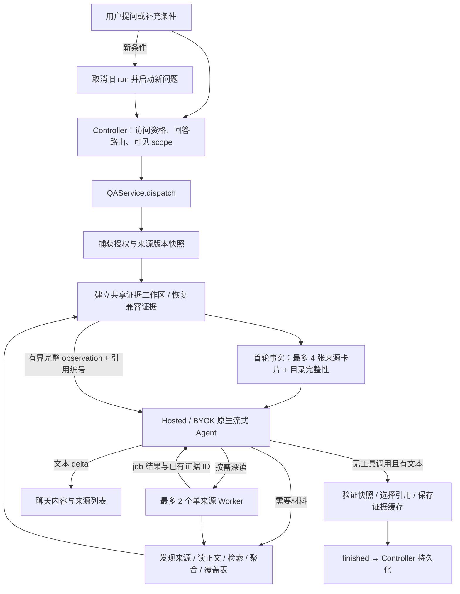

# 知识库问答流程（重构后当前实现）

核对日期：2026-10-04

范围：`voxella-studio-app` macOS 客户端；代码基准：`72cb65e4`，包含 `d2fec273` 的用途路由重构。

本文依据当前源码核对，作为知识库 QA 的主流程说明。历史方案、实施记录和质量评测分别保留，见文末。

## 1. 入口与回答责任

| 入口 | 回答者 | 路径 |
| --- | --- | --- |
| App Knowledge 页 | App 配置的 Hosted / BYOK 模型 | Controller → QAService → 原生 Agent → 证据工具 → 流式回答 |
| `/mcp` 的 `knowledge.ask` | App 配置的 Hosted / BYOK 模型 | MCP adapter → 同一个 QAService；等待终态后返回 JSON |
| `/knowledge/mcp` 的六个只读工具 | Work / Codex 等宿主模型 | 宿主调用证据工具，取得材料后自行综合回答 |
| Debug `VOXELLA_KB_QA_VARIANT=B0` / 显式 `legacyAnswer` | legacy answer 路由 | Query planning → 共享检索 → context → answer |

默认路径由 `KnowledgeQAService.dispatch` 直接进入 `KnowledgeAgentRuntime.run`。问题理解、按需阅读、工具选择和回答由同一个 Agent 完成；没有前置 planner、skill selector、simple/inventory/complex router，也没有独立的最终 Answer Composer。缺少 skill 或原生 provider 不兼容时不会自动改走 legacy。

## 2. App 问答主流程



### 2.1 发送与门禁

`KnowledgeBaseController.send` 检查非空输入、本地 Trial/Lifetime 访问资格、回答模型可用性及 scope 可见性。Hosted 需要登录且没有已知额度耗尽；BYOK 需要有效 `.chat` 配置，原生协议是否受支持在 runtime 创建 client 时检查。

本地 WeMM / reranker 缺失已不作为每题发送的下载门禁。`flushPendingQueryIfNeeded` 按 `missingCount: 0` 放行；目录、已有摘要及正文直读可以独立使用。下载入口仍保留，需要的资源缺失时相应检索能力降级。没有 Transcript 的可见来源仍可回答元数据或已有摘要问题；全库空 scope 也可开始问答。

发送时固定 `scope / conversationID / requestID`。新问题会取消正在回答的旧 run。用户消息先保存，再创建 streaming assistant；消费事件时检查会话、scope 和 requestID，避免迟到结果写进新会话。

### 2.2 授权快照、首轮事实与历史

`KnowledgeScopeSnapshot.capture` 固定可见来源、账户 ID、授权 epoch 和来源 generation。scope 为 `.all / .session / .sessions`，同时应用 local/cloud 来源过滤；索引检索另通过 `SessionSearchFilter.visible` 校验 cloud owner。

首轮只放入最多四张廉价来源卡片，包含标题、类型、来源、创建/修改日期、正文/摘要可用性、正文长度及已知时长。附带 `total_count / complete / catalog_next_cursor`；这四张卡片不是完整目录，按 source UUID 排序，也不表示“最新四份”。详细元数据与本地媒体探测按需读取。

历史只保留最多八条符合条件的消息：用户消息用于指代消解；assistant 消息需带当前快照内来源的引用，旧引用编号会从文本中移除。历史回答标为未核验，当前问题单独标记，并在工具结果之后再次提醒。证据缓存可复用原始观察和覆盖表；provider 私有 reasoning 仅在当前 run 的原生 continuation 内回放。

### 2.3 原生循环

每轮向 provider 提供 system prompt、原生 tool schema 和消息，消费真实 `textDelta / toolUseComplete / messageStop / tokenUsage` 等事件。业务工具名如 `knowledge.search` 映射为 provider 名 `knowledge_search`，由 registry 执行类型及字段校验。

有 tool call 时，为每个调用生成对应的 tool result，保持原调用顺序，再续接下一轮。独立 I/O 以最多四个分支的批次执行；覆盖表更新、委托、读取 worker 结果及澄清等状态操作所在批次顺序执行。参数错误、未知/越权工具和多数工具业务失败返回可恢复 observation；取消会向上传播。相同 scope、工具、参数在同一工作区最多执行两次，第三次提示复用证据或改变取证方向。

模型没有工具调用且返回非空文本时自然结束。没有 `finish_with_evidence` 工具；空文本、缺少终止事件或输出耗尽会结束为失败。`ask_clarification` 在原生路径中返回 `clarification_question` observation，再由模型面向用户输出问题；它不直接触发 UI 的 `.clarification` 终态。legacy planner 的澄清仍使用该终态。

## 3. 正文、材料与时间定位

所有 QA 默认正文选择经 `KnowledgeTranscriptMaterial` 统一，供 App、索引、原文读取、查词、引用和 MCP 共用。

| 来源情况 | 当前默认正文 |
| --- | --- |
| 普通原会话 | 非空 Transcript 优先；缺失时使用该会话原字幕 |
| 独立配音 / dub session | 自身当前 Transcript / dubTranscript，随后自身字幕 / dubSubtitleTrack；role 为 voiceover，携带当前 revision |
| 非空 text-only Transcript | 可读；不能对齐当前文字的旧 segments / words 不覆盖正文，时间为未知 |
| 部分 Transcript | 只使用现有 Transcript，不借字幕补尾 |
| 无任何可读正文 | unavailable；元数据和已有摘要仍可使用 |
| 明确请求字幕或翻译 | 新 MCP 显式选择材料、语言；与默认 canonical 正文分开 |

普通原会话不会静默借用关联配音或翻译内容。`provenance` 区分 `original_segments / dub_segments / subtitle_fallback`，并保留 role、revision、generation 和原文 UTF-16 字符范围。只有与当前文字顺序匹配的可信 aligned words 才细化时间；否则使用真实父 segment/cue 的粗范围或 unknown，不按字数推算时码。

检索分块与新 MCP read units 使用约 45–60 秒软窗，结合句界、speaker 变化及 tokenizer 硬预算：目标 512 tokens、正文最大 768、独立前文 context 最多 64，模型完整输入最多 1,024。长 segment 可继续拆分，全文及字符映射保留。实际 tokenizer 校验可用时使用实际 token 数；缺少模型文件时用当前 ByteLevel tokenizer 的 NFC UTF-8 字节上界保守计算。分块在独立 CPU task 中执行，缓存有界且支持取消。

App 原生 `session.get_segments` 则经 `KnowledgeBodyReader.nativeParts` 保留普通 segment 的数字 cursor 语义；超长 segment 按最多 8,000 字拆页。一次 observation 最多 16,000 字，工具条数默认 80、上限 200，因此即使达到条数上限前也可能需要翻页。摘要和 `read_payload` 每页最多 8,000 字。两类读取共用权威文字及原文映射，但分页单位、预算和 cursor 格式不同。

`complete=true` 表示当前过滤条件下可用材料已读完，不能证明全媒体已经转录，也不能证明语义上没有某事。

## 4. 索引与共享检索

### 4.1 用途与索引 lane

`Search/index.sqlite` 承载会话卡片、正文 units、FTS5、sqlite-vec 和可选图。`index_lane_state` 分别维护 knowledge / media manifest 及词法、embedding 就绪状态。

- knowledge lane：当前 canonical 正文、正文 FTS / 向量及关联图证据。
- media lane：字幕素材窗口、mediaClip、text/video/mixed 向量；独立视频帧索引及预览路径继续保留。

正文变化只替换正文 lane；素材 manifest 变化才替换媒体 lane。强制 QA 重建保留未变化媒体；真正删除 session 才统一清理。首次迁移核对旧素材窗口与材料，接管匹配的 clips / 向量；逐模态补齐只推理缺失通道。字幕编辑在 Transcript 已可用时不使 canonical 正文失效，作为 subtitle fallback 时则会改变正文 generation。

正文与 manifest 在 SQLite 事务中切换。后台索引支持 pause/resume，取消后按当前材料重新 reconcile。候选前按权限、scope、kind 和当前 canonical generation 过滤，防止旧正文或素材挤占 QA 候选。

### 4.2 QA 检索链路

```text
knowledge.search / session.search_segments
  → 可见 scope + 当前 canonical generation
  → SearchService.transcriptSearch（仅 transcriptChunk）
      → FTS5 词法 + 可用 WeMM text embedding → RRF
  → 显式 use_graph=true 时，并行尝试 Graph recall
  → Hybrid / Graph 按 source + unit 去重、RRF 融合
  → Qwen3 reranker（只用 query 与原始候选正文）
  → MMR（已有向量；缺失时词项 Jaccard）
  → 有限候选 + 原文范围 / 时间 / provenance / citations
```

| 环节 | 当前默认 / 限制 |
| --- | --- |
| Hybrid 结果交给共享检索层 | 30 |
| Graph 结果 | 最多 20；默认关闭，工具需显式启用且图配置可用 |
| 融合候选 | 最多 40 |
| Hybrid ∥ Graph 总等待 | 8 秒；Graph 自身子预算 5 秒 |
| Reranker | 独立 5 秒预算；超长候选全文拆窗取最高相关性 |
| MMR | λ=0.7；默认返回 8，上限 32 |

中文词法补充双字词元，英文保留词级词元，自然语言使用 OR 排序召回；字面短语及计数另用 `find_text` 核验。Graph 用作关联线索，返回结果仍经当前正文核验，graph path 不当作回答原话。

reranker 分数只作排序信号。`KnowledgeRerankPolicy.thresholded` 当前只筛有限数值并排序，旧 `0.25 / 0.175 / 0.15` 常量虽仍在源码中，已不执行硬过滤。模型缺失、失败或超时使用融合 RRF 分数继续 MMR；相关性按当前最大分数缩放，避免小分数时多样性压过相关性。显式多来源 scope 的 MMR 尽可能保留已有候选来源，缺少候选的来源仍是缺口。

QA 无命中不会自动调用通用 clip search。素材搜索显式使用 `media_clips`，可融合 text/video/mixed 并保留命中模态；字幕和分数只提供媒体定位候选，不能证明画面事实。

## 5. App Agent 的工具与方法

以下为业务名；provider schema 使用点号替换为下划线的名称。

| 工具 | 用途与边界 |
| --- | --- |
| `knowledge.search` / `session.search_segments` | canonical 原文候选；默认 8、最多 32；`complete=false / candidate_set_only=true` |
| `session.list` | 完整授权目录分页；标题为字面子串过滤；默认 32、最多 100 |
| `knowledge.get_session_metadata` | 元数据、材料能力、总时长与 provenance；按需探测本地媒体 |
| `session.get_summary` | 已有生成摘要的分页读取；不自动生成摘要，不充当原话 |
| `session.get_segments` | 连续原文，支持时间范围、speaker 和分页 |
| `session.get_timeline` | 当前原文页的分桶时间线，默认 60 秒；仍需跟随分页 |
| `session.get_speakers` | 可用 speaker labels；缺失不证明没有人说话 |
| `knowledge.compare_sessions` | 两份以上来源的摘要及可选 focus hits；不是已完成的全文比较 |
| `session.aggregate` | 完整筛选目录的 count / 已知时长 sum / type 或 origin 分组 / 排序 |
| `knowledge.search_sources` | 通过来源卡片、摘要及正文发现候选；Top-K 不代表全集 |
| `knowledge.find_text` | 可用原文中的字面匹配，大小写不敏感、空白归一；区分 occurrence 数与返回片段数 |
| `analysis.update` | 来源 × 问题维度覆盖表，保留未知与冲突；是工作区状态更新 |
| `read_skill` | 按需读取方法正文，最多 16,000 字；不能扩展工具权限 |
| `read_payload` | 通过工作区句柄分页重读完整 observation |
| `ask_clarification` | 返回澄清问题 observation，供模型后续输出 |
| `knowledge_delegate` / `knowledge_worker_result` | runtime 额外注册的可选深读 job；不是 dotted registry 工具 |

Skills 来自 bundle 的五个 `Resources/KnowledgeSkills/*/SKILL.md` 和已安装的 `knowledge / knowledge-qa` 类别。runtime 校验 `allowed_tools` 是否属于 registry，首轮仅列方法目录，模型按需 `read_skill`；不会先让 selector 选三项，也不会因为未选方法回退 legacy。方法的 allowed_tools 是指导与校验信息，不缩小主 Agent 的核心权限。当前内置方法提供材料、引用与覆盖指导，去掉每题强制 metadata-first 和固定命中数流程。

runtime 的 system prompt 仍提供读取策略：短正文（卡片长度 ≤16,000 字）优先直接读到末页；长来源按摘要/时间结构浏览再定位与连续阅读。精确标题用目录查找，语义主题用来源发现，穷举用全部目录页；查不到与明确不存在分别记录。这些是 Agent 指导，不是新的固定路由器。

## 6. 证据、引用、统计与追问

`KnowledgeEvidenceWorkspace` 保存原始 observation、`payload_ref`、稳定 `evidence_id`、统一 `citation_number`、机械读取范围及可选分析表。下一轮拿到完整有界结果，去掉重复 citation snippet 以减少上下文；完整原 payload 仍可重读。worker findings 必须引用分配来源的已有 evidence ID，返回节选索引及 payload 句柄；读取覆盖由实际工具记录提供，不采信 worker 自报全文完整。

分析表每个来源 × 维度区分 `unchecked / not_found / supported / conflict / absent / unavailable`；`supported / conflict / absent` 必须引用该来源已有证据。状态校验不能自动证明模型结论在语义上成立。

`session.aggregate` 对完整筛选集合计算，不用第一页或语义搜索命中数当总数。`media_duration_sec` 为实际探测或来源 hint，`last_spoken_end_sec` 和 `transcribed_range` 为原文位置；未知总长保留 null。按 duration 排序时最多四路并发探测完整筛选集合的本地媒体，仍保留 `duration_unknown_count`。创建/导入和修改日期不是录制日期。

回答按 `[citation_number]` 引用。终态以实际标记选择引用，保留统一编号；无标记时兼容保留读过的内容证据，纯元数据回答可保留事实卡片，因此有 Sources 不等于通过事实正确性校验。UI 按来源 ID 分组，同源多个原文位置仍可跳转；同名不同来源不合并。历史引用通过材料 generation / 字符范围 / provenance 核验，旧 chunkIndex 不直接当作新正文行号。

缓存为进程内、会话级的原始证据复用，非持久研究任务。key 包括会话、scope、账户授权 epoch、来源完整版本、reader/chunker/tokenizer 与模型 revision，工具缓存另带精确参数。删除、重转录、正文/摘要/标题/配音 revision 或媒体文件版本变化会使旧快照/缓存失效；兼容来源可用于追问。更新问题通过取消旧 run、重新建立任务完成，未实现同一 run 的 async steering。

## 7. Provider、预算和失败行为

| 限制 | 当前值 |
| --- | --- |
| 主 Agent 原生模型回合 | 最多 8 |
| Worker | 每 run 最多 2 个 job；各最多 4 回合、单层、不可再委托 |
| 主 Agent + workers 共享模型回合 | 最多 16 |
| 原生循环外层运行等待 | 180 秒；预算也以 180 秒检查 |
| 单模型回合等待 | 60 秒 |
| 每请求输出 cap | 4,096 |
| 共享上下文/输出预留量 | 240,000 保守单位；有 provider usage 时逐请求 reconcile |
| 等待 worker 结果 | 每次最多 10 秒；未完成返回 running，不另启 job |

Hosted 使用 `HostedAgentClient(useCase: "knowledgeQA")`；服务端选择实际模型与 fallback，客户端 schema 不能保证服务器版本化 KB capabilities。BYOK 使用原生兼容路由，初始 failover/retry 可用；收到任何 provider event 后固定该模型用于后续 continuation 和 worker，私有状态不跨 provider 回放。预算中的 native request count 不等于传输重试次数，预留单位不等于账单 token / 费用。

每个模型事件校验授权，每轮和工具执行前后核验来源版本；完成时再次验证。Controller 处理 `.status / .delta / .citations / .finished / .failed` 等事件并保存一份终态。原生失败保留已经发布的文字，显示独立错误并结束 streaming；不会再启动 composer 或保证带引用摘录降级。Hosted 已知额度耗尽阻止新问答，运行中额度错误显示失败；legacy 的摘录及恢复 actions 属于 legacy 分支。

取消、切换 scope / 账户或来源变化停止旧结果；补充条件可复用兼容证据。所有 worker 在主 run 完成/失败时取消。

## 8. Legacy 与开发对照

Debug 可用 `VOXELLA_KB_QA_VARIANT` 选择：

| 值 | 路径 / 能力 |
| --- | --- |
| B0 | QAService legacy：planning → retrieval → context → answer |
| B1 | 原生基础工具；不暴露来源发现、speaker 工具、覆盖表/聚合与 worker |
| B2 | 增加来源发现与 speaker 工具 |
| B3 | 增加 `analysis.update / session.aggregate` |
| B4 / 默认 | 完整工作区能力，worker 按需使用 |

Release 固定完整 B4 能力。B0 仍使用已重构的 canonical / retrieval 实现；当前 B0 与原生结果相同不能证明优于旧版。严格旧基线需单独构建重构前 `f2d9f81b` 并记录版本。

`KnowledgeQAExecutionPolicy` 的 overall=56 秒、understanding=8 秒、answer=30 秒用于 legacy 调度；其 retrieval / graph / rerank 子预算也供共享检索使用，不能当成原生 run 的总预算。legacy 的 planner/context/摘录降级实现保留，但不代表正常问答流程。

## 9. 只读 MCP 证据流程

```text
Work / Codex 问题
  → /knowledge/mcp：授权快照、来源/材料过滤
  → search / list_sources / aggregate / methods
  → fetch / find_text：核验当前材料、原文范围与时间
  → 宿主模型综合并引用证据
```

新 profile 只暴露 `search / fetch / list_sources / aggregate / find_text / methods`，不调用 App 回答 Agent，也不需要配置 App 的 Hosted / BYOK 回答路由。账户可见性及来源版本校验仍有效。新入口每次 tool call 建工作区，不复用 App conversation 的证据缓存；宿主维护自己的对话和取证过程。

`search target=passages` 默认 canonical；显式 `subtitle_passages / media_clips / sources` 保留各自材料语义。`fetch` 以 `view=body / summary / metadata / timeline / media` 选择视图，以 `material=canonical / subtitles / translation` 选择文本材料。`evidence_id` 是带 source/material/generation/原文范围的 `kb:` locator，不是 App 工作区 `ev_…` 编号；新 cursor 是绑定查询和版本的 opaque string，旧原生工具 cursor 是数字 offset，两者不能互换。

默认服务端口 19789。`/mcp` 与 `/knowledge/mcp` 的 factory、session 和无状态回退隔离，跨 profile session ID 返回 404。旧 `knowledge.ask` 接收调用方 history，等待完成后返回回答/引用 JSON，不写入 App 聊天记录。精确接口与请求示例见 [Local MCP 知识库](../local-mcp-knowledge.md)。

## 10. 源码、文档与验证边界

| 代码 | 负责内容 |
| --- | --- |
| [KnowledgeBaseController.swift](../../Sources/VoxstudioPro/Knowledge/KnowledgeBaseController.swift) | 发送门禁、取消、流式 UI 与聊天持久化 |
| [KnowledgeQAService.swift](../../Sources/VoxstudioPro/Knowledge/KnowledgeQAService.swift) | 默认 dispatch 与显式 legacy 分支 |
| [KnowledgeAgentRuntime.swift](../../Sources/VoxstudioPro/Knowledge/Agent/KnowledgeAgentRuntime.swift) | 原生循环、provider、预算、worker 与当前问题提示 |
| [KnowledgeToolRegistry.swift](../../Sources/VoxstudioPro/Knowledge/Agent/KnowledgeToolRegistry.swift)、[KnowledgeToolExecutor.swift](../../Sources/VoxstudioPro/Knowledge/Agent/KnowledgeToolExecutor.swift) | Schema、工具执行、材料读取与确定性统计 |
| [KnowledgeEvidenceWorkspace.swift](../../Sources/VoxstudioPro/Knowledge/Agent/KnowledgeEvidenceWorkspace.swift) | 快照、证据编号、payload、覆盖表与缓存 |
| [KnowledgeCanonicalBody.swift](../../Sources/VoxstudioPro/Knowledge/KnowledgeCanonicalBody.swift)、[KnowledgeTextTokenizer.swift](../../Sources/VoxstudioPro/Knowledge/KnowledgeTextTokenizer.swift)、[KnowledgeBodyReader.swift](../../Sources/VoxstudioPro/Knowledge/KnowledgeBodyReader.swift) | 权威正文、分块预算与原生读取 |
| [SessionIndexCoordinator.swift](../../Sources/VoxstudioPro/Search/RAG/SessionIndexCoordinator.swift)、[SessionIndexStore.swift](../../Sources/VoxstudioPro/Search/RAG/SessionIndexStore.swift) | 正文/素材 lane、事务与索引 freshness |
| [KnowledgeRetrievalService.swift](../../Sources/VoxstudioPro/Knowledge/KnowledgeRetrievalService.swift)、[SearchService.swift](../../Sources/VoxstudioPro/Search/RAG/SearchService.swift)、[KnowledgeReranking.swift](../../Sources/VoxstudioPro/Knowledge/KnowledgeReranking.swift) | 范围过滤、Hybrid/Graph/RRF、rerank 与 MMR |
| [MCPKnowledgeBaseTools.swift](../../Sources/VoxstudioPro/Agent/MCP/MCPKnowledgeBaseTools.swift)、[MCPKnowledgeTools.swift](../../Sources/VoxstudioPro/Agent/MCP/MCPKnowledgeTools.swift) | 新只读证据 profile 与旧完整 QA adapter |
| [SkillStore.swift](../../Sources/VoxstudioPro/Agent/Skills/SkillStore.swift)、[KnowledgeQAExperimentVariant.swift](../../Sources/VoxstudioPro/Knowledge/Agent/KnowledgeQAExperimentVariant.swift) | 方法目录与 B1–B4 开发能力开关 |

关联资料：

- [用途路由实施说明](knowledge-qa-purpose-routing.zh-CN.md)：正文、分通道索引和素材能力的重构细节。
- [Agentic QA v2 实施记录](knowledge-base-agentic-qa-v2-implementation.zh-CN.md)：分阶段交付、审查修复和挂起排查历史。
- [Agentic QA v2 设计提案](knowledge-base-agentic-qa-v2.zh-CN.md)：方案及规划目标，不能作为全部已实现的证明。
- [2026-10-03 验证记录](../testing/knowledge-purpose-qa-2026-10-03/STATUS.md)：既有 276 tests / 65 suites 回归、4 个真实本地模型测试及单题 App 回答验收；本文整理没有重新执行这些测试。
- [受控质量 fixture](../../Tests/Fixtures/Knowledge/purpose-qa-v1/README.md)：60 题、98 个模型辅助复核证据范围。检索 Recall / nDCG 与回答正确率分开；正式多题宿主回答、skill 消融、真实费用仍未测。

本次文档核对纠正了旧流程中的前置 planner/selector、文本 JSON loop、无 skill 回退、统一模型下载门禁、8 条硬上限、reranker 分数硬过滤和过期 MCP 控制工具说明。源码中残留的 P0 注释、threshold 常量及错误字符串不作为当前行为依据；应以可达调用分支为准。
