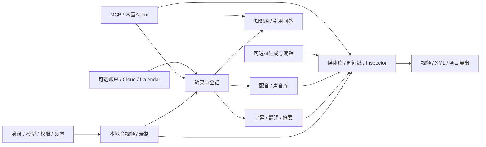

# VoxStudio 功能地图

基线日期：2026-10-01；源码基线：`404b55d8` 加当前工作区。此地图以当前原生应用入口和源码为依据，旧 README 中 Palmier 名称不作为发布状态证据。代码存在、UI 可进入、真实端测通过是不同状态；本文件是功能设计清单，不是通过报告。

当前登记 **71 个功能单元、357 个回归用例**。功能单元按用户可独立完成的任务或一组紧密关联的操作划分；表中范围列说明子操作，所有单元都有至少 5 个明确用例。增加用户可独立调用的新能力时分配新 ID，并补足至少 5 个用例；不要把新能力默默塞入一个大类后宣称已覆盖。

测试入口：[回归测试计划](../testing/voxstudio-feature-regression/test-plan.md)。执行 skill：[voxstudio-feature-regression](../../skills/voxstudio-feature-regression/SKILL.md)。上一轮实测：[2026-10-01 本地端测](../test/voxstudio-local-e2e-2026-10-01.md)。

## 用户工作流

## 前置条件标记

| 标记 | 含义 |
|---|---|
| L | 本机能力；需准备素材、临时工程及所需本地模型。 |
| P | 涉及录制、麦克风或系统权限；先执行人工权限准备与实际采集复核。 |
| H | 需要物理设备/外接显示器；缺硬件记录 Blocked-Hardware。 |
| B | 部分操作使用已配置 BYOK/LLM；先确认数据目的地及本轮授权，不能统称完全离线。 |
| X | 依赖外部服务、生成额度、软件安装、更新或测试交易；逐用例检查范围和授权。 |
| C | 账户/Cloud/Calendar相关；默认本地回归跳过身份登录及Cloud外发，完整模式也不自动解除用户排除项。 |

标记是准备条件，不是购买或登录授权。不同签名/渠道、模型catalog或服务能力会影响按钮可见性；已确认渠道不支持时记 N/A 并给源码/入口证据，不能把缺按钮当通过。证据列中`skills/`与`docs/`开头的路径相对仓库根目录，其余相对`Sources/VoxstudioPro/`。

## 应用与工作区

| Feature ID | 功能单元 | 范围 | 前置 | 用例 | 主要源码证据（相对 Sources/VoxstudioPro） |
|---|---|---|---|---:|---|
| [A01](../testing/voxstudio-feature-regression/app.md#a01) | 应用启动与构建身份 | 本地包启动、单实例、版本和签名 | L | 5 | App/AppDelegate.swift；App/main.swift |
| [A02](../testing/voxstudio-feature-regression/app.md#a02) | 首次运行与本地准备 | 引导、功能介绍、模型准备和重新进入 | L | 5 | Onboarding/OnboardingView.swift；Onboarding/LocalFeaturePreparation.swift |
| [A03](../testing/voxstudio-feature-regression/app.md#a03) | 工作区导航与任务检索 | Create、Recent、前进后退、全局 session 搜索 | L | 5 | Workbench/WorkbenchNavigator.swift；Workbench/SessionSearchPalette.swift |
| [A04](../testing/voxstudio-feature-regression/app.md#a04) | 界面布局与操作可达性 | 面板、应用缩放、全屏、主题、本地化、快捷键 | L | 5 | App/MainMenu.swift；Editor/ViewModel/EditorViewModel+Layout.swift；Localization |

## 转录与会话

| Feature ID | 功能单元 | 范围 | 前置 | 用例 | 主要源码证据（相对 Sources/VoxstudioPro） |
|---|---|---|---|---:|---|
| [T01](../testing/voxstudio-feature-regression/transcription.md#t01) | 音视频导入与范围选择 | 本地文件、音轨提取、起止范围和输入校验 | L | 5 | Workbench/TranscribeWorkbenchView.swift；Workbench/MediaRangeExtractor.swift |
| [T02](../testing/voxstudio-feature-regression/transcription.md#t02) | 本地转录与说话人识别 | 语音识别、语言、时间段、说话人标签 | L | 5 | Transcription；LocalAI；Workbench/TranscriptionProcessingView.swift |
| [T03](../testing/voxstudio-feature-regression/transcription.md#t03) | 转录任务生命周期与恢复 | 进度、取消、失败、重转录、刷新状态 | L | 5 | Workbench/WorkbenchSessionStatus.swift；Workbench/WorkbenchStore.swift |
| [T04](../testing/voxstudio-feature-regression/transcription.md#t04) | 转录文本与说话人编辑 | 段落编辑、split/merge、说话人增改 | L | 5 | Workbench/SessionSegmentEditor.swift |
| [T05](../testing/voxstudio-feature-regression/transcription.md#t05) | 字幕分段与重新分段 | 词级时间、cue 长度与重建 | L | 5 | MediaPanel/CaptionsTab/CaptionBuilder.swift；Workbench/SubtitleSegmentationInfoButton.swift |
| [T06](../testing/voxstudio-feature-regression/transcription.md#t06) | 多语言翻译与双语轨 | 英文等翻译、多轨、字幕选择、双语顺序 | B | 5 | Workbench/WorkbenchSessionView.swift；Workbench/SessionExport.swift |
| [T07](../testing/voxstudio-feature-regression/transcription.md#t07) | 摘要与模板 | 摘要生成、My Template、重新生成 | B | 5 | Workbench/SessionSummaryTemplateSheet.swift；Workbench/WorkbenchSessionView.swift |
| [T08](../testing/voxstudio-feature-regression/transcription.md#t08) | 会话媒体播放与字幕同步 | 原音/增强/配音、seek、字幕显示 | L | 5 | Workbench/SessionMediaPlayback.swift；Workbench/AudioPlaybackCoordinator.swift |
| [T09](../testing/voxstudio-feature-regression/transcription.md#t09) | 转录与字幕导出 | TXT/SRT/VTT、复制、原文/译文/双语 | L | 5 | Workbench/SessionExport.swift；Workbench/SessionExportCenter.swift |
| [T10](../testing/voxstudio-feature-regression/transcription.md#t10) | 音频增强与音频导出 | 本地增强、试听、Original/Enhanced/Dub导出 | L | 5 | Editor/ViewModel/EditorViewModel+AudioEnhance.swift；Workbench/SessionExport.swift |
| [T11](../testing/voxstudio-feature-regression/transcription.md#t11) | 会话库与本机数据管理 | 列表、筛选、源文件定位、测试会话删除 | L | 5 | Workbench/WorkbenchLibraryView.swift；Workbench/WorkbenchSessionListRow.swift |

## 录制

| Feature ID | 功能单元 | 范围 | 前置 | 用例 | 主要源码证据（相对 Sources/VoxstudioPro） |
|---|---|---|---|---:|---|
| [R01](../testing/voxstudio-feature-regression/recording.md#r01) | 录制权限与目标包身份 | 路径一致、enabled、签名、人工授权与实录复核 | P | 5 | Workbench/Recording/RecordingScreenCaptureAuthorization.swift；skills/voxstudio-debug-build/references/signing-and-tcc.md |
| [R02](../testing/voxstudio-feature-regression/recording.md#r02) | 音频源与混音 | 麦克风、system audio、独立选择、音量警告 | P | 5 | Workbench/Recording/RecordingAudioMixer.swift；Workbench/Recording/RecordingAudioDevices.swift |
| [R03](../testing/voxstudio-feature-regression/recording.md#r03) | 整屏录制 | Display选择、多屏、画面及系统音 | P | 5 | Workbench/Recording/ScreenCaptureRecordingEngine.swift；Workbench/Recording/RecordingContentPicker.swift |
| [R04](../testing/voxstudio-feature-regression/recording.md#r04) | 指定应用录制 | App选择、进程、多应用和音频 | P | 5 | Workbench/Recording/RecordingApplicationSelection.swift；Workbench/Recording/RecordingApplicationPicker.swift |
| [R05](../testing/voxstudio-feature-regression/recording.md#r05) | 指定窗口录制 | 系统窗口选择器、单窗、重选 | P | 5 | Workbench/Recording/RecordingWindowSelection.swift；Workbench/Recording/RecordingContentPicker.swift |
| [R06](../testing/voxstudio-feature-regression/recording.md#r06) | 区域录制 | Region框选、坐标、多屏与取消 | P | 5 | Workbench/Recording/DisplayRegionOverlay.swift |
| [R07](../testing/voxstudio-feature-regression/recording.md#r07) | USB移动设备录制 | iPhone/iPad枚举、屏幕、device audio、可选mic | H | 5 | Workbench/Recording/MobileDeviceCaptureSource.swift |
| [R08](../testing/voxstudio-feature-regression/recording.md#r08) | 录制视频质量设置 | Automatic/1080p/720p、帧率、质量与预设 | P | 5 | Workbench/Recording/RecordingVideoSettings.swift；Workbench/Recording/RecordingVideoSettingsView.swift |
| [R09](../testing/voxstudio-feature-regression/recording.md#r09) | 录制控制与运行状态 | 开始、pause/resume、停止、浮窗、菜单栏 | P | 5 | Workbench/Recording/RecordingFloatingControls.swift；Workbench/Recording/RecordingStatusItemController.swift |
| [R10](../testing/voxstudio-feature-regression/recording.md#r10) | 录制审阅、裁剪与后续转录 | Review、保留全长、裁剪、取消、恢复 | P | 5 | Workbench/Recording/RecordingReview.swift；Workbench/Recording/RecordingSessionManifest.swift |
| [R11](../testing/voxstudio-feature-regression/recording.md#r11) | 本地会议快捷录制 | 检测会议应用、本地App/Window/Display快捷入口 | P | 5 | MeetBot/LocalMeetingRecordingSection.swift；MeetBot/MeetingAppPresence.swift |

## 配音与声音库

| Feature ID | 功能单元 | 范围 | 前置 | 用例 | 主要源码证据（相对 Sources/VoxstudioPro） |
|---|---|---|---|---:|---|
| [D01](../testing/voxstudio-feature-regression/voiceover.md#d01) | 本地文字配音 | 文本、语言、声音、生成、播放与输出 | L | 5 | Workbench/DubWorkbenchView.swift；Workbench/DubOutputPlayer.swift |
| [D02](../testing/voxstudio-feature-regression/voiceover.md#d02) | 多段配音、转录导入与AI改写 | 段落顺序、Speaker声音、Source/Translation导入 | B | 5 | Workbench/DubWorkbenchView.swift；Workbench/DubRewriteController.swift |
| [D03](../testing/voxstudio-feature-regression/voiceover.md#d03) | 声音参考与声音库 | 导入/录制reference、文本、头像、默认声音、预览 | L | 5 | Workbench/VoiceLibraryView.swift；Workbench/VoiceReferenceSpeechGate.swift |
| [D04](../testing/voxstudio-feature-regression/voiceover.md#d04) | 从转录创建配音与版本 | 目标语言、speaker映射、dub revisions | B | 5 | Workbench/WorkbenchSessionView.swift；Editor/EditorDubSheet.swift |

## 知识库

| Feature ID | 功能单元 | 范围 | 前置 | 用例 | 主要源码证据（相对 Sources/VoxstudioPro） |
|---|---|---|---|---:|---|
| [K01](../testing/voxstudio-feature-regression/knowledge.md#k01) | 知识来源、索引与范围 | Source列表、索引可用性、当前/多会话范围 | L | 5 | Knowledge/KnowledgeSourceListView.swift；Search/Indexing |
| [K02](../testing/voxstudio-feature-regression/knowledge.md#k02) | 语义检索与图谱召回 | 语义搜索、rerank、graph recall与证据范围 | L | 5 | Knowledge/KnowledgeRetrievalService.swift；Knowledge/KnowledgeGraphServices.swift |
| [K03](../testing/voxstudio-feature-regression/knowledge.md#k03) | 知识问答与多轮交互 | 有证据答案、scope、多轮、取消和模型路由 | B | 5 | Knowledge/KnowledgeQAService.swift；Knowledge/Agent/KnowledgeAgentRuntime.swift |
| [K04](../testing/voxstudio-feature-regression/knowledge.md#k04) | 引用定位与来源摘要 | citation chip、转录范围、时间戳、来源摘要 | B | 5 | Knowledge/CitationResolver.swift；Knowledge/KnowledgeTranscriptView.swift |
| [K05](../testing/voxstudio-feature-regression/knowledge.md#k05) | 知识对话持久化与恢复 | 会话切换、消息复制、错误恢复入口 | B | 5 | Knowledge/KnowledgeChatStore.swift；Knowledge/KnowledgeChatPane.swift |

## 视频编辑器

| Feature ID | 功能单元 | 范围 | 前置 | 用例 | 主要源码证据（相对 Sources/VoxstudioPro） |
|---|---|---|---|---:|---|
| [E01](../testing/voxstudio-feature-regression/video-editor.md#e01) | 项目建立、设置与保存 | New/Open/Save As、分辨率fps比例、恢复 | L | 5 | Project/VideoProject.swift；Project/Settings；Editor/ViewModel/EditorViewModel+ProjectSettings.swift |
| [E02](../testing/voxstudio-feature-regression/video-editor.md#e02) | 媒体库与文件关联 | Import、文件夹、sort/filter/search、relink/swap | L | 5 | MediaPanel/MediaTab；Editor/ViewModel/EditorViewModel+Relink.swift；Editor/ViewModel/EditorViewModel+MediaSwap.swift |
| [E03](../testing/voxstudio-feature-regression/video-editor.md#e03) | 时间线添加、选择、移动与吸附 | drag/add/insert、位置、范围选择、zoom/snap | L | 5 | Timeline/TimelineInputController.swift；Timeline/SnapEngine.swift |
| [E04](../testing/voxstudio-feature-regression/video-editor.md#e04) | 剪切、分割与修剪 | Razor、Split at playhead、Trim Start/End | L | 5 | Editor/ViewModel/EditorViewModel+ClipMutations.swift；Toolbar/ToolbarView.swift |
| [E05](../testing/voxstudio-feature-regression/video-editor.md#e05) | Ripple、Overwrite与剪贴板 | ripple delete/trim、overwrite、cut/copy/paste、undo | L | 5 | Editor/RippleEngine.swift；Editor/OverwriteEngine.swift；Editor/ViewModel/EditorViewModel+Clipboard.swift |
| [E06](../testing/voxstudio-feature-regression/video-editor.md#e06) | 轨道、链接与片段控制 | 增删轨、锁定mute/solo、音视频link/unlink | L | 5 | Editor/ViewModel/EditorViewModel+Tracks.swift；Editor/ViewModel/EditorViewModel+Linking.swift |
| [E07](../testing/voxstudio-feature-regression/video-editor.md#e07) | 多时间线与嵌套 | new/active timeline、nest/unnest | L | 5 | Editor/ViewModel/EditorViewModel+Timelines.swift；Editor/ViewModel/EditorViewModel+Nesting.swift |
| [E08](../testing/voxstudio-feature-regression/video-editor.md#e08) | 多机位与同步 | 音频同步、时间对齐、多机位角度切换 | L | 5 | Timeline/MulticamEngine.swift；Inspector/Tabs/MulticamTab.swift；Editor/ViewModel/EditorViewModel+Sync.swift |
| [E09](../testing/voxstudio-feature-regression/video-editor.md#e09) | 预览播放、速度与帧抓取 | play/seek/frame step/speed/zoom、capture frame | L | 5 | Preview；Editor/ViewModel/EditorViewModel+FrameCapture.swift |
| [E10](../testing/voxstudio-feature-regression/video-editor.md#e10) | 变换、属性与关键帧 | position/scale/rotate/opacity、插值、keyframe | L | 5 | Inspector/Keyframes；Inspector/Components/InspectorPositionFields.swift；Editor/ViewModel/EditorViewModel+Keyframes.swift |
| [E11](../testing/voxstudio-feature-regression/video-editor.md#e11) | 文字与时间线字幕 | Add Text、字体/颜色/样式、captions导入和编辑 | L | 5 | Inspector/Tabs/TextTab.swift；MediaPanel/CaptionsTab；Toolbar/ToolbarView.swift |
| [E12](../testing/voxstudio-feature-regression/video-editor.md#e12) | 调色、特效与抠像 | Adjust、curves/color wheels、chroma key/matte | L | 5 | Inspector/Tabs/AdjustTab.swift；Editor/ViewModel/EditorViewModel+ChromaKey.swift；Editor/ViewModel/EditorViewModel+Matte.swift |
| [E13](../testing/voxstudio-feature-regression/video-editor.md#e13) | 音频剪辑、节奏与空白处理 | gain/fades/speed、enhance、dead air、beats | L | 5 | Inspector/Tabs/AudioTab.swift；Audio/Beats；Editor/ViewModel/EditorViewModel+DeadAir.swift |
| [E14](../testing/voxstudio-feature-regression/video-editor.md#e14) | 成片编码与导出队列 | H264/H265/ProRes/HDR、resolution、queue | L | 5 | Export/ExportView.swift；Export/ExportQueue.swift；Export/HDRVideoExporter.swift |
| [E15](../testing/voxstudio-feature-regression/video-editor.md#e15) | 时间线交换与项目打包导出 | XML/FCPXML、Palmier Project及媒体完整性 | L | 5 | Export/XMLExporter.swift；Export/FCPXMLExporter.swift；Export/PalmierProjectExporter.swift |

## 生成、Agent与MCP

| Feature ID | 功能单元 | 范围 | 前置 | 用例 | 主要源码证据（相对 Sources/VoxstudioPro） |
|---|---|---|---|---:|---|
| [G01](../testing/voxstudio-feature-regression/agent-mcp.md#g01) | 内置AI编辑助手 | 聊天、context、工具变更、恢复和取消 | B | 5 | Agent/Panel；Agent/Tools/ToolDefinitions.swift |
| [G02](../testing/voxstudio-feature-regression/agent-mcp.md#g02) | AI图像生成 | 模型/参考图/参数、任务与导入输出 | X | 5 | Generation/Submission/ImageGenerationSubmission.swift；Generation/UI/GenerationView.swift |
| [G03](../testing/voxstudio-feature-regression/agent-mcp.md#g03) | AI视频生成 | text/image/reference、时长/比例、任务 | X | 5 | Generation/Submission/VideoGenerationSubmission.swift；Generation/Preprocessing/VideoPreprocessor.swift |
| [G04](../testing/voxstudio-feature-regression/agent-mcp.md#g04) | AI音频生成 | 音频model/catalog、素材引用和输出 | X | 5 | Generation/Submission/AudioGenerationSubmission.swift；Generation/Catalog/AudioModelConfig.swift |
| [G05](../testing/voxstudio-feature-regression/agent-mcp.md#g05) | AI媒体编辑与变换 | Upscale/Edit/Lip Sync/Reframe/音频变换/音乐SFX | X | 7 | Generation/Edit/AIEditMenu.swift；Generation/Edit/EditSubmitter.swift |
| [G06](../testing/voxstudio-feature-regression/agent-mcp.md#g06) | MCP编辑器工具 | 本地HTTP服务、工程/track/clip/export工具 | L | 5 | Agent/MCP/MCPService.swift；Agent/Tools/ToolDefinitions.swift |
| [G07](../testing/voxstudio-feature-regression/agent-mcp.md#g07) | MCP媒体处理工具 | voice/transcription/dubbing/media status/preview | L | 5 | Agent/MCP/MCPMediaTools.swift |
| [G08](../testing/voxstudio-feature-regression/agent-mcp.md#g08) | MCP知识工具 | knowledge.ask与检索/证据工具、scope | B | 5 | Agent/MCP/MCPKnowledgeTools.swift；Knowledge/Agent/KnowledgeToolRegistry.swift |
| [G09](../testing/voxstudio-feature-regression/agent-mcp.md#g09) | 应用内Skills管理 | 社区/已安装、详情、启用和外部agent入口 | X | 5 | Settings/Skill；Agent/Skills |

## 设置与语音输入

| Feature ID | 功能单元 | 范围 | 前置 | 用例 | 主要源码证据（相对 Sources/VoxstudioPro） |
|---|---|---|---|---:|---|
| [S01](../testing/voxstudio-feature-regression/settings.md#s01) | 本地模型与资源管理 | Local Features readiness、安装、取消、空间 | L | 5 | Settings/ModelsPane.swift；Workbench/LocalModelInstallPlan.swift |
| [S02](../testing/voxstudio-feature-regression/settings.md#s02) | BYOK Provider与模型路由 | API provider、测试连接、模型发现、task overrides | B | 5 | Settings/AISettingsPane.swift；Settings/AIRequestOverridesView.swift；LLM |
| [S03](../testing/voxstudio-feature-regression/settings.md#s03) | 录制与Voice Input偏好 | 默认视频配置、音频增强开关、dictation快捷键 | P | 5 | Settings/RecordingPane.swift；Settings/VoiceInputSettingsPane.swift |
| [S04](../testing/voxstudio-feature-regression/settings.md#s04) | 存储、缓存与媒体索引 | Storage统计、indexing开关、清理与重建 | L | 5 | Settings/StoragePane.swift；Search/Indexing |
| [S05](../testing/voxstudio-feature-regression/settings.md#s05) | 通知、隐私与诊断偏好 | notifications、analytics/crash reports、保存 | L | 5 | Settings/NotificationsPane.swift；Settings/PrivacyPane.swift；Telemetry |
| [S06](../testing/voxstudio-feature-regression/settings.md#s06) | Help、反馈与更新 | About/shortcuts、反馈预览、Sparkle渠道 | X | 5 | Help/HelpView.swift；Help/FeedbackView.swift；Settings/UpdatesPane.swift；App/AppUpdater.swift |
| [S07](../testing/voxstudio-feature-regression/settings.md#s07) | Dictation与语音输入 | mic准备、global/inline输入、取消和恢复 | P | 5 | SpeechInput/VoiceInputCoordinator.swift；SpeechInput/SpeechInputRecovery.swift |

## 账户、Cloud及可选集成

| Feature ID | 功能单元 | 范围 | 前置 | 用例 | 主要源码证据（相对 Sources/VoxstudioPro） |
|---|---|---|---|---:|---|
| [C01](../testing/voxstudio-feature-regression/cloud-optional.md#c01) | 账户与VoxStudio Cloud登录 | signed-out、Google/Apple登录、登出与会话 | C | 5 | Account；Settings/AccountPane.swift |
| [C02](../testing/voxstudio-feature-regression/cloud-optional.md#c02) | Cloud处理、上传与同步 | process/keep in Cloud、同步状态、retry | C | 5 | Workbench/CloudSessionSync.swift；Workbench/ProcessingOptionsSheet.swift |
| [C03](../testing/voxstudio-feature-regression/cloud-optional.md#c03) | 授权、购买与恢复（仅测试环境） | direct license、MAS lifetime、restore、entitlements | X | 5 | Account；Settings/AccountPane.swift；docs/design/mac-license-key-activation.md |
| [C04](../testing/voxstudio-feature-regression/cloud-optional.md#c04) | Calendar与云会议Bot | Google Calendar OAuth、会议列表、bot启用重试 | C | 5 | MeetBot/GoogleCalendarSettingsPane.swift；MeetBot/MeetBotView.swift |
| [C05](../testing/voxstudio-feature-regression/cloud-optional.md#c05) | 在线视频导入 | YouTube URL/元信息/音频导入/浮窗播放 | X | 5 | Workbench/NetVideo；Workbench/NetVideoFloatingPlayer.swift |

## 使用边界与维护

- 所有用例当前为“已设计，未在本任务执行”。上一轮转录/配音等有限成功路径不足以证明整张地图通过。
- 已知基线风险：T06 英文翻译曾结束于 Needs attention；R01/R03–R06 录制权限未完成实录验收；E03 时间线添加及 E14 成片导出此前未完成。新回归需优先重测这些路径，不能沿用旧结论。
- 当前还存在其他工作区源码改动；本任务只新增文档与 skill，未改这些源码。每次回归记录 commit、dirty状态、包路径、版本/build和二进制hash，保证结果对应待测包。
- 发现遗漏入口时先更新本地图与测试集，再执行新增用例。源目录列是定位依据，实施前仍需确认具体入口和渠道；AI生成的模型名以运行时catalog为准。
